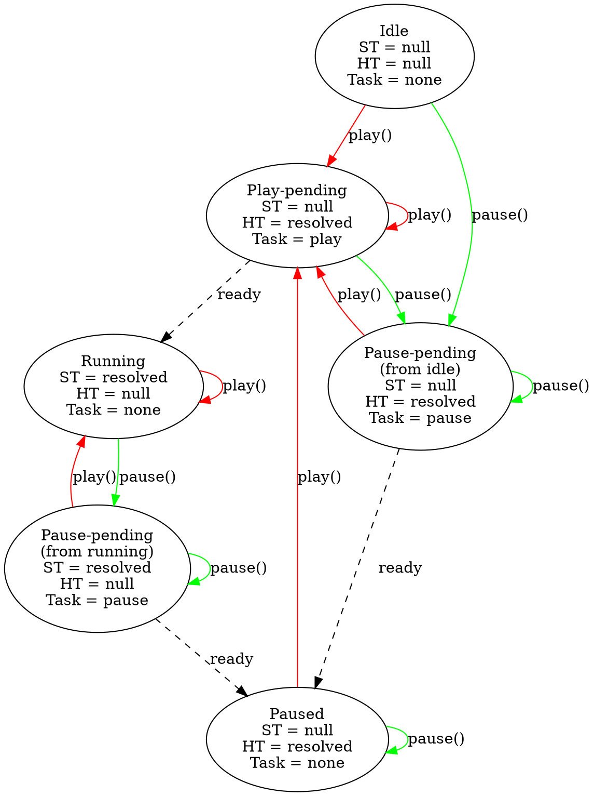

_From @birtles on November 24, 2016 7:31_

In experimenting with scroll-driven timelines we often have the situation where we want the state of the timeline to determine whether animations are in-effect or not. For example, you may want the timeline to be active for a certain scroll range and animations to have no effect outside that range.

This is quite tricky, because I imagine that there are some use cases were you have multiple animations associated with the same `ScrollTimeline` where you want *some* to fill backwards and others not to. However, I can't see any combination of timeline and effect `fillMode` that will produce that result.

That suggests to me that timelines actually have four states:

* truly inactive -- i.e. some sort of preconditions are not satisfied and the timeline cannot produce any kind of sensible state (this state might not be needed)
* before start -- i.e. the timeline current time is effectively a hairs' width before zero. Backwards-filling animations associated with it fill backwards, other animations are idle
* after end -- i.e. the timeline has reached its natural end. Forwards-filling animations associated with it fill forwards, other animations are idle
* in range -- i.e. playing normally

That analysis might not be right, but whatever approach we take I think we need to have a consistent answer to the following questions:

* If you play an animation associated with a timeline that is out of its range--what is the state of the animation?
* If you play an animation not associated with a timeline, what does it do initially, and when you later attach a timeline?
* If you set the `startTime` of an animation not associated with a timeline, what does it do initially, and when you later attach a timeline?
* If you hot-swap timelines, is the current time preserved? And, closely related, do the following code fragments produce the same result:
```js
// A:
anim.timeline = timeline2;
// B:
anim.timeline = null;
anim.timeline = timeline2;
```
* Similarly, do animations preserve their state (`startTime` I guess) when re-attaching to the same timeline. i.e. in what circumstances is the following effectively a no-op:
```js
const timeline = anim.timeline;
anim.timeline = null;
anim.timeline = timeline;
```

I think we have pretty consistent answers to the above currently, but our answers don't work well with inactive timelines and finite timelines.

We also need to bear in mind the following use cases:

1. An animation that is idle until its timeline starts to play
1. An animation that is filling backwards until its timeline starts to play
1. Likewise for the above at the other end of the timeline
1. Set the initial playback position of an animation so that when its timeline starts to play, it picks up from that point
1. Hot-swapping timelines (switch from scroll-based to time-based)
1. Seek an animation that is not attached to a timeline and get meaningful values out of it

The last one is particularly interesting and would be nice to support if possible (we currently do).

Do we also need to support timelines with multiple independent playback ranges? i.e. are the four states above insufficiently general?

https://github.com/theres-waldo/scroll-driven-animations/issues/1 contains some further details of issues we've hit with this.

_Copied from original issue: w3c/web-animations#174_

<!-- comment id=349194647 author=birtles created=2017-12-05T04:48:52Z url=https://github.com/w3c/csswg-drafts/issues/2066#issuecomment-349194647 -->
## @birtles — 2017-12-05

To explain some of the background to how this currently works (for my own notes as much as anything), animations have two values: _start time_ and _current time_ which are tied together as follows:

* During normal playback, current time is calculated from start time using the timeline time.
* In some circumstances, we calculate the start time from the current time such as:
  * When setting the current time (assuming we're playing normally; including when calling `finish()`)
  * When playing an animation with a fixed current time (i.e. a paused animation)
  * When updating the playback rate where we want to preserve the current time

In general, the start time and current time are tied together by the timeline time. When we're paused, we have a current time but no start time. Setting the start time, sends you to either the idle state (if you have no active timeline) or the pending/running state.

If we have no active timeline, we have an invariant that you can only set either the current time (hold time) or start time but not both. If we allowed you to set both, then when you later have an active timeline we'd have to choose which one to use. So, while you have an inactive timeline, setting one will clear the other.

In fact, it's generally true to say that you can only ever set one--the other one will be cleared (and then calculated immediately, or when we go to play the animation).

<!-- comment id=349194650 author=birtles created=2017-12-05T04:48:52Z url=https://github.com/w3c/csswg-drafts/issues/2066#issuecomment-349194650 -->
## @birtles — 2017-12-05

One thought is to have scroll-timelines report negative infinity and positive infinity when outside their range. Then fill modes on animations would work as expected. We'd still need to make the model work correctly with infinite timeline time values (which may be non-trivial) but it would obviate the need for passing further state from timeline to animation to effect (and the extra IDL members to represent it and potential bugs when you failed to check those extra IDL members).

<!-- comment id=349194653 author=birtles created=2017-12-05T04:48:53Z url=https://github.com/w3c/csswg-drafts/issues/2066#issuecomment-349194653 -->
## @birtles — 2017-12-05

Chatting with @theres-waldo one possibility for preserving the current time when hot-swapping timelines (that probably addresses the requirements in the first comment) is that we say that if you set the timeline to null, we set the hold time. i.e.

```js
const currentTime = anim.currentTime;
anim.timeline = null;
assert(anim.currentTime === currentTime); // Animation is frozen
```

<!-- comment id=392666675 author=birtles created=2018-05-29T06:29:54Z url=https://github.com/w3c/csswg-drafts/issues/2066#issuecomment-392666675 -->
## @birtles — 2018-05-29

This is quite confusing. I tried making animations preserve their current time as the hold time but it's complicated by the fact that pause state is represented by the lack of a start time, and when an animation doesn't have a timeline, you can really only set either the start time or the hold time meaningfully.

For example, suppose we have:

```js
const anim = elem.animate(...);
await anim.ready;
```

At this point `anim` has a `startTime` relative to `elem.ownerDocument.timeline`.

Now if we clear the timeline...

```js
anim.timeline = null;
```

What we're suggesting in this issue is that `anim`'s hold time is set such that it keeps its current time. However, we have an invariant in the model that says that if an animation doesn't have an active timeline it can only have _either_ a resolved hold time _or_ a resolved start time since otherwise once you attach another timeline we don't know which one to honor.

That means that we'd need to clear the `startTime` giving us:

```js
console.log(anim.currentTime); // Some number like 52.12...
console.log(anim.startTime); // null
console.log(anim.playState); // paused
```

Now, what should happen if we re-attach a timeline?

```js
anim.timeline = new DocumentTimeline();
console.log(anim.playState); // running? paused?
```

Whether it is running or paused will depend on whether or not we resolve a new `startTime` based on the hold time. Presumably we _do_ want to do that.

That begs the question, however, what should happen if we do the following?

```js
anim.pause();
anim.timeline = null;
anim.timeline = new DocumentTimeline();
```

Assuming we resolve a new `startTime` as suggested above, suddenly `anim` would start playing just because we attached a new timeline which is a little odd. (And we'd need to be careful to make the behavior consistent between whether we set `null` first or not.)

We currently avoid this by saying that the hold time is cleared when we change timelines. That way the paused state is preserved (through the resolved-ness of the `startTime` which is _not_ updated).

A few options that come to mind here if we _do_ want to preserve the current time:

* Just say that setting a timeline is equivalent to playing. Get used to it.
* Drop the invariant about only being able to set `startTime` or hold time on an animation without an active timeline and say that when we re-attach a timeline, if the hold time is set we recalculate the `startTime` from it (i.e. hold time has priority over `startTime`).

That last option is fairly attractive. It does mean, however, that you can end up with pretty useless `startTime` values for an animation without an active timeline (in many cases we'd just be preserving it to represent paused-ness).

Furthermore, such animations will report themselves as running. i.e.

```js
const anim = elem.animate(...);
anim.timeline = null;
console.log(anim.playState); // running
```

But maybe that's ok? In a sense it tells you what the animation will do when you do attach a timeline. Furthermore, in an academic sense, maybe you could say the animation actually _is_ running, it's just that it is following the infinitely slow null timeline hence why it doesn't progress.

That last point might make even more sense if we later make a distinction between monotonic timelines and infinite timelines (see #2075) where in the latter the `startTime` is possibly ignored. In that case, the null timeline would simply be an instance of an infinite timeline where the `startTime` is ignored. (Although I'm not sure how we'll indicate paused-ness in that world -- presumably we still want to be able to pause scroll-driven timelines? Maybe they will have a `startTime` that is either zero or `null` depending on if they're running or not?)

<!-- comment id=557630869 author=ogerchikov created=2019-11-22T17:57:29Z url=https://github.com/w3c/csswg-drafts/issues/2066#issuecomment-557630869 -->
## @ogerchikov — 2019-11-22

In an effort to integrate ScrollTimeline with web animations we came along undefined behaviors, such as:
- Handling unresolved timeline current time by animations. Use cases, based on ScrollTimeline spec:
  - scroll < scrollTimeline.startScrollOffset and scrollTimeline.fill == none or backwards
  - scroll > scrollTimeline.endScrollOffset and scrollTimeline.fill == none or forwards
  - scrollTimeline.startScrollOffset == scrollTimeline.endScrollOffset
- Handling inactive timelines by animations. Use cases, based on ScrollTimeline spec:
  - scroll source does not currently have a CSS layout box
  - scroll source  layout box is not a scroll container

To eliminate a requirement to handle unresolved current time we proposed removing scrollTimeline.fill attribute. Instead, resolve the current time for cases when scroll is outside of start and end offsets as follows:
- If scrollTimeline.startScrollOffset is specified and scroll < startScrollOffset, current time = (0 -  epsilon) (or -infinity).
- If scrollTimeline.endScrollOffset is specified and scroll > endScrollOffset, current_time = (duration + epsilon) (or +infinity).

_What was the original intention to bring scrollTimeline.fill attribute in and which functionality is compromised if the attribute is removed?_

As a result, we extended scroll timeline inactiveness definition to include  scrollTimeline.startScrollOffset == scrollTimeline.endScrollOffset condition and specified the following behavior of animations in regards to handling inactive timelines:
- If animation is playing and timeline becomes inactive, the animation should have no effect applied as if animation.play() was never called.
- As soon as the timeline becomes active, the animation should start playing again without user intervention.

```
scroll_timeline = new ScrollTimeline({scrollSource: scroller, ...});
animation = new Animation(new KeyframeEffect(...}], { duration: 2000}), scroll_timeline);
animation.play();

scroller.scrollTop = 50px;
console.log(animation.startTime); // 0
console.log(animation.currentTime); // some number
console.log(animation.playState); // running

scroller.style.overflow="none"

console.log(animation.startTime); // null
console.log(animation.currentTime); // null
console.log(animation.playState); // running

scroller.style.overflow="scroll"

console.log(animation.startTime); // 0
console.log(animation.currentTime); // some number
console.log(animation.playState); // running
```


Problems with this proposal:

- Hold time is lost when transitioning between active and inactive states. See [this ](https://docs.google.com/document/d/1A2vK9FVAoAUSHLJQYQvFlBGdfqFyznj8Fxq5baIxIvQ/edit?usp=sharing)diagram.
- Requires substantial changes in web animations spec to redefine playState.

@majido brought a case that perhaps inactive timelines should be handled similarly to null timelines. Intuitively these cases look similar and it would be nice to unify the behavior.  Currently running animations with null timeline have start_time = null and hold_time = 0 as illustrated in this [example](https://www.google.com/url?q=https://jsbin.com/jakefanige/1/edit?js,output&sa=D&ust=1574439510888000&usg=AFQjCNGUU9B62zkDyH0hIKyyCN7kUeAKzQ), which works in Firefox too. However animation effect is applied and it is undesired behavior for inactive timelines.

We are looking for suggestions and insights on this subject.

<!-- comment id=563576690 author=majido created=2019-12-10T02:04:04Z url=https://github.com/w3c/csswg-drafts/issues/2066#issuecomment-563576690 -->
## @majido — 2019-12-10

## Removing ScrollTimeline fill

I support removing `ScrollTimeline.fill`. It makes sense and improves quite a few thing:
 - The current fill property actually does not work as expected in combination with AnimationEffect.fill. See #4325  for more info on this.
 - Once removed, we no longer need to [special case the end scroll offset `auto` to be inclusive](https://github.com/WICG/scroll-animations/issues/19#issuecomment-460680068)
-  Author are able to control the animation value in the before/after portion of scrollRange using AnimationEffect.fill
- As a minor benefit, with this change the timeline is no longer considered "inactive" for a valid scroller that is outside scrollRange. This limits "inactive" to only occur for more specific and rare cases. I think this is a good side benefit of this change. More on this below.


## Inactive Timeline Behavior

If we apply the above change to fill then timeline in-activeness become limited to the case where
the scroll timeline scroll source element is null or not a valid scroller (e.g., `overflow: visible`).

One interesting case that I like to focus here is a scroller with `overflow:auto` whose content changes overtime. Consider such a scroller that (1) its content initially overflowing, then at some point (2) its content shrinks so it no longer overflows, and finally (3) its content grows again so that the scroller overflows again. I believe if scroll timeline can handle this correctly most other cases would naturally follow. Which is why I think it is a good example.

Per [above comment](https://github.com/w3c/csswg-drafts/issues/2066#issuecomment-557630869), ideally we went for scroll-linked animation at (1)  to have an effect according to the scroll offset, at (2) to have no effect, at (3) to again have effect according to the scroll offset. All of these without requiring authors to anticipate and care about the size of the scroller inner content.

Also my preference is if we can have ScrollTimeline with none-scrolling source to behave similar to a null timeline. The following note in the spec suggests this was also the intent:

 > This step makes the behavior when an animation’s timeline becomes inactive consistent with when it is disassociated with a timeline. Furthermore, it ensures that the only occasion on which an animation becomes idle, is when the procedure to cancel an animation is performed.

But I think the [current prose](https://drafts.csswg.org/web-animations/#responding-to-a-newly-inactive-timeline) behaves differently, in particular it causes the animation to be in the `paused` play state when timeline becomes inactive as opposed to the `idle`.

My tests with Firefox nightly suggests that Gecko behaves very closely to what I would think is the most desired behavior when timeline is switched between a null and and active timeline (e.g., `document.timeline`).

[Here](https://codepen.io/majido/pen/RwNrBxp) is a simple code pen that shows this.

A. An animation with an active timeline plays as expected.
B. If animation.timeline is set to null, animation goes into `idle` and has no effect.
C. As soon as animation timeline is set to document.timeline, animations starts playing again with play state `running` 
C**. Same as C, but if animation was "paused" when timeline changes from null to active, the animation goes from idle to "paused".

Basically, when timeline goes from active<=>null, the animation goes from paused/running <=> idle and back as expected without any action from the author. I think timeline going from active to inactive should behave the same.

 

<!-- comment id=567038463 author=birtles created=2019-12-18T13:48:12Z url=https://github.com/w3c/csswg-drafts/issues/2066#issuecomment-567038463 -->
## @birtles — 2019-12-18

> To eliminate a requirement to handle unresolved current time we proposed removing scrollTimeline.fill attribute.

I don't think this is the right reason to drop the fill attribute. We still have to handle unresolved current times one way or another.

However, I think a good reason for dropping the fill attribute is the scenario described in the second paragraph of the first comment in this issue and in Majid's comment above this one.

> Instead, resolve the current time for cases when scroll is outside of start and end offsets as follows:
> 
> * If scrollTimeline.startScrollOffset is specified and scroll < startScrollOffset, current time = (0 -  epsilon) (or -infinity).
> 
> * If scrollTimeline.endScrollOffset is specified and scroll > endScrollOffset, current_time = (duration + epsilon) (or +infinity).

We should make this magic explicit and introduce the states described in the first comment in this issue.

> As a result, we extended scroll timeline inactiveness definition to include scrollTimeline.startScrollOffset == scrollTimeline.endScrollOffset condition and specified the following behavior of animations in regards to handling inactive timelines:
> 
> * If animation is playing and timeline becomes inactive, the animation should have no effect applied as if animation.play() was never called.

What does this mean? Is it equivalent to canceling? Is the start time preserved?

> * As soon as the timeline becomes active, the animation should start playing again without user intervention.

Right, this is use case 1 from the first comment in this issue.

> @majido brought a case that perhaps inactive timelines should be handled similarly to null timelines.

Yep, that same suggestion is made earlier in this thread.

> > This step makes the behavior when an animation’s timeline becomes inactive consistent with when it is disassociated with a timeline. Furthermore, it ensures that the only occasion on which an animation becomes idle, is when the procedure to cancel an animation is performed.
> 
> But I think the [current prose](https://drafts.csswg.org/web-animations/#responding-to-a-newly-inactive-timeline) behaves differently, in particular it causes the animation to be in the `paused` play state when timeline becomes inactive as opposed to the `idle`.

I think that's what the text is saying--it should be come `paused`, not `idle`. I think Firefox might have a bug there, or maybe the spec text for the two cases just got out of sync.


Going through this issue and all the others, I think we're converging on something like the following approach:

* Drop fill modes from `ScrollTimeline`
  * This should fix #4325 and may partially address #4324 (since we would presumably no longer enter the `idle` state).
* Introduce the additional timeline states mentioned in the first comment in this thread (e.g. before-start, after-end, in range).
  * This would address #4347 too (and possibly #4341).
* Introduce a distinction between montonic timelines (`DocumentTimeline`) and finite timelines (`ScrollTimeline`). Define it such that the null timeline is a finite timeline.
* Drop the invariant about being only able to set the hold time or start time when we have an inactive timeline.
* When attaching an active timeline or when an inactive timeline becomes active, always prioritize using the hold time over the start time (that is we re-calculate the start time from the hold time if they are both set, then clear the hold time), but we preserve both for the sake of representing paused-ness.
  * I think this _might_ happen to fix #2048 too.
* Make the play procedure differentiate between different types of timelines such that for finite timelines, if the current time is unresolved we effectively set the start time to zero, ignoring the current state of the timeline. We could possibly pass a flag for this and address #2051 at the same time. (This is a bit awkward and needs more thought. If we want to allow the `startTime` to represent an offset from the timeline in this case, we will need different logic for pausing/unpausing.)
  * This should fix #2075 and is basically (B) from what Majid suggested there.

So the last point is the main one that needs work and one of the questions it raises is whether or not it is ever useful to have an animation that runs at some offset from a fixed timeline (i.e. whether it is ok to simply always make `startTime` zero). I think it is preferable if we can keep `startTime` having some meaning. Being able to seek a scroll animation seems useful, and giving `startTime` some meaning for finite timelines makes the model a little less awkward.

However, it raises questions about how pausing/unpausing works since normally we'd recalculate the `startTime` from the timeline time then. Pausing/unpausing with finite timelines is already weird though, so maybe it doesn't matter too much.

We also still need to check the 6 use cases in the start of this issue are addressed by this.

<!-- comment id=567255509 author=birtles created=2019-12-18T23:17:03Z url=https://github.com/w3c/csswg-drafts/issues/2066#issuecomment-567255509 -->
## @birtles — 2019-12-18

Thinking about the start time issue bit further:

* For a paused animation linked to a scroll timeline, making `play()` cause the animation to jump to the current position of the scroller seems fine for most cases. That is, the current Chromium implementation of setting `startTime` to 0 or null seems fine for most cses.
* However, we still need to allow setting the `startTime` to other values because:
  * At very least, we want to be able to seek an `Animation` without a timeline and if a null timeline and a scroll timeline are in the same class of timelines, that suggests we should be able to set the `currentTime` on an animation attached to a scroll timeline, which, in turn, implies being able to set the `startTime` to something other than zero.
  * Being able to seek a scroll-driven animation seems somewhat useful.
  * Having the `startTime` setter throw when setting any other value than zero or null while the animation is attached to a scroll timeline is odd.
  * When hot-swapping from a document timeline to a scroll timeline, presumably we want to preserve the `currentTime`, which also implies being able to set the `startTime` (this use case could use more careful thought, however).
  * (It would be nice to be able to set up a scroll-driven animation that runs at some offset from its scroll timeline by using `startTime` seems useful but preserving that offset could be hard.)
* The different classes of timelines needs more thought. If we think about a timeline based on a media element (e.g. `<video>`) it is generally both finite (except for the streaming case) and non-monotonic. In that sense, it is similar to the scroll timeline case. However, it differs in that if you hit `play()` on an animation bound to the `<video>` timeline, you probably want it to start at the current video time--or at least I believe there are use cases for both.

In some sense, we can already handle these different cases by, e.g. doing `anim.startTime = 0` instead of `anim.play()` but I suspect authors are going to reach for `anim.play()` first so we need to make that do something sensible.

<!-- comment id=568565738 author=ogerchikov created=2019-12-23T19:48:42Z url=https://github.com/w3c/csswg-drafts/issues/2066#issuecomment-568565738 -->
## @ogerchikov — 2019-12-23

# Proposal for Spec Changes Based on Discussion on 2019-12-18
## Scroll Timeline - Dropping Fill Mode
1. https://drafts.csswg.org/scroll-animations-1/#dom-scrolltimeline-fill - remove fill attribute.
1. https://drafts.csswg.org/scroll-animations-1/#current-time-algorithm - update ScrollTimeline.currentTime calculation as follows:
    - If current scroll offset is less than startScrollOffset, return (0 - epsilon) or -infinity.
    - If current scroll offset is greater than or equal to endScrollOffset, return ( effective time range + epsilon) or +infinity.
    - Consider: do we need explicitly address a case when startScrollOffset equals to endScrollOffset?
1. https://drafts.csswg.org/web-animations-1/#animationtimeline -  add timeline state readonly attribute: TimelineState {Inactive, BeforeStart, InRange, AfterEnd}

Timeline State | Document Timeline | Scroll Timeline | Null Timeline | Animation Behavior
------------ | ------------- | ------------ | ------------- | -------------
Inactive | https://drafts.csswg.org/web-animations-1/#document-timelines: Prior to establishing the time origin for its associated document, a document timeline is inactive. A document timeline that is associated with a Document which is not an active document is also considered to be inactive. | If `scrollSource  `is null, does not currently have a CSS layout box, or if its layout box is not a scroll container, return an unresolved time value. | always | ‘Paused’ animations - no change. Other animations become idle unless animation.currentTime is set.
BeforeStart | never | If current scroll offset is less than `startScrollOffset `| never | Backwards filling animations fill backwards, other show no effect.
InRange | Always when the timeline is active. | If current scroll offset is  greater than or equal to `startScrollOffset` and  less than `endScrollOffset`. | never | Playing normally
AfterEnd | never | If current scroll offset is greater than or equal to `endScrollOffset `| never | Forwards filling animations fill forwards, other show no effect. | Forwards filling animations fill forwards, other show no effect.

## Web Animations Spec Changes
For the purpose of this discussion null timeline is handled the same as inactive timeline.

1.  https://drafts.csswg.org/web-animations/#responding-to-a-newly-inactive-timeline - drop this section. Instead clarify animation state when responding to inactive timeline as follows:
    - Start time is preserved.
    - Hold time is unresolved.
    - Play state is ‘idle’.
1. Add a section “Responding to a newly active timeline”:
    - If hold_time is resolved, calculate start_time based on the hold_time and timeline current time.
1. https://drafts.csswg.org/web-animations/#playing-an-animation-section - update to handle inactive timelines as follows:
    - If the timeline is inactive and both animation start and current time are unresolved, set start time to zero (or timeline.getInitialCurrentTime()) 
1. https://drafts.csswg.org/web-animations/#pausing-an-animation-section - update to handle inactive timelines. Differentiate between states:
    - Start and hold time are unresolved, play state is ‘idle’ (animation.play was not called).
    - Start time is resolved, hold time is unresolved, play state is ‘idle’ (play was called).
    - Start and hold time are resolved, play stay is ‘paused’ (play was called, timeline became inactive, animation.currentTime was set)
1. https://drafts.csswg.org/web-animations/#setting-the-current-time-of-an-animation - drop #3:
    - If animation has no associated timeline or the associated timeline is inactive, make animation’s start time unresolved.
    - This preserves the invariant that when we don’t have an active timeline it is only possible to set either the start time or the animation’s current time.
1. https://drafts.csswg.org/web-animations/#play-states
    1. Include the following condition into the “paused” state definition:
        - If both start and hold time are resolved and timeline is inactive (or null).
    1. Include the following condition into the “idle” state definition:
        - The current time of animation is unresolved, the timeline is inactive and has pending play state.
## Use Cases
1. An animation that is idle until its timeline starts to play
    ```javascript
    scroller.style.overflow="none";
    scroll_timeline = new ScrollTimeline({scrollSource: scroller, ...});
    animation = new Animation(new KeyframeEffect(...}], { duration: 2000}), scroll_timeline);
    animation.play();
    console.log(animation.startTime); // 0
    console.log(animation.currentTime); // null
    console.log(animation.playState); // idle
    ```
1. An animation that is filling backwards until its timeline starts to play.
    - Same as bullet 1.
1. Likewise for the above at the other end of the timeline.
    - _Is it playback rate < 0? If so exactly as bullet 1._
1. Set the initial playback position of an animation so that when its timeline starts to play, it picks up from that point.
    ```javascript
    scroller.style.overflow="none";
    scroll_timeline = new ScrollTimeline({scrollSource: scroller, ...});
    animation = new Animation(new KeyframeEffect(...}], { duration: 2000}), scroll_timeline);
    animation.currentTime = 100;
    animation.play();
    console.log(animation.startTime); // 0
    console.log(animation.currentTime); // 100 
    console.log(animation.playState); // paused
    // make the timeline active
    scroller.style.overflow="scroll";
    console.log(animation.startTime); // 0
    console.log(animation.currentTime); // 100 
    console.log(animation.playState); // running
    ```
1. Hot-swapping timelines (switch from scroll-based to time-based).
    ```javascript
    scroller.style.overflow="scroll";
    scroll_timeline = new ScrollTimeline({scrollSource: scroller, ...});
    animation = new Animation(new KeyframeEffect(...}], { duration: 2000}), scroll_timeline);
    animation.play();
    ...
    scroller.scrollTop = '50px';
    ...
    console.log(animation.startTime); // 0
    console.log(animation.currentTime); // 500 or some other number 
    console.log(animation.playState); // running 

    animation.timeline = document.timeline;
    console.log(animation.startTime); // 0
    console.log(animation.currentTime); // some number based on the new timeline.currentTime
    console.log(animation.playState); // running or finished
    ```
1. Timeline becomes newly inactive while the animation is playing.
    ```javascript
    scroller.style.overflow="scroll";
    scroll_timeline = new ScrollTimeline({scrollSource: scroller, ...});
    animation = new Animation(new KeyframeEffect(...}], { duration: 2000}), scroll_timeline);
    animation.play();
    ...
    scroller.scrollTop = '50px';
    ...
    console.log(animation.startTime); // 0
    console.log(animation.currentTime); // 500 or some other number 
    console.log(animation.playState); // running 
    // Make the timeline inactive
    scroller.style.overflow="none";
    console.log(animation.startTime); // 0
    console.log(animation.currentTime); // null
    console.log(animation.playState); // idle 
    ```
1. Seek an animation that is not attached to an active timeline and get meaningful values out of it.
    ```javascript
    // Continuation of the above
    scroller.style.overflow="none";
    console.log(animation.startTime); // 0
    console.log(animation.currentTime); // null
    console.log(animation.playState); // idle 
    animation.currentTime = 1000;
    console.log(animation.startTime); // 0
    console.log(animation.currentTime); // 1000
    console.log(animation.playState); // paused
    ```
1. Cont. bullet 7 - the timeline becomes active.
    ```javascript
    scroller.style.overflow="scroll";
    console.log(animation.startTime); // some number calculated from the current time of 1000.
    console.log(animation.currentTime); // 1000
    console.log(animation.playState); // running
    ```

<!-- comment id=576967673 author=birtles created=2020-01-22T01:35:38Z url=https://github.com/w3c/csswg-drafts/issues/2066#issuecomment-576967673 -->
## @birtles — 2020-01-22

Sorry for my delay in reviewing this. It's looking good but there are a few parts I'm unsure about.

> 2. https://drafts.csswg.org/scroll-animations-1/#current-time-algorithm - update ScrollTimeline.currentTime calculation as follows:
> 
>     * If current scroll offset is less than startScrollOffset, return (0 - epsilon) or -infinity.
> 
>     * If current scroll offset is greater than or equal to endScrollOffset, return ( effective time range + epsilon) or +infinity.
> 
>     * Consider: do we need explicitly address a case when startScrollOffset equals to endScrollOffset?

I want to avoid returning any epsilon values. That still leaves open the question of what is the current time of a timeline when it is in the new `BeforeStart` or `AfterEnd` states.

My intuition here is simply that it should be `0` or `effective time range` respectively. That can lead to bugs if script fails to check the timeline state, but given that it is the current time that will be used by those animations that are deemed to be active in those states, I think it's the most correct behavior.

> 3. https://drafts.csswg.org/web-animations-1/#animationtimeline -  add timeline state readonly attribute: TimelineState {Inactive, BeforeStart, InRange, AfterEnd}

This table looks good.

> ## Web Animations Spec Changes
> 
> For the purpose of this discussion null timeline is handled the same as inactive timeline.
> 
> 1. https://drafts.csswg.org/web-animations/#responding-to-a-newly-inactive-timeline - drop this section. Instead clarify animation state when responding to inactive timeline as follows:
>     * Start time is preserved.
>     * Hold time is unresolved.
>     * Play state is ‘idle’.
> 
> 2. Add a section “Responding to a newly active timeline”:
>     * If hold_time is resolved, calculate start_time based on the hold_time and timeline current time.

I'm a little unsure about this. It would mean that if we have an animation that is paused, then if the timeline temporarily became inactive, it would become idle. An animation that is running, however, would resume running after the timeline became active again.

By comparison, if we set the timeline to null and then back again, the paused animation would continue being paused. That's because the procedure for setting a timeline only clears the hold time if the start time is set.

(Also, note that we wouldn't specify that "Play state is `idle`" since play state is a calculated field.)

I suspect the procedure for responding to a newly inactive timeline might need to cancel pending play/pause tasks. Or perhaps those tasks would need to be updated since the play pending task asserts that either start time or hold time is set but that will no longer be the case if we unconditionally clear the hold time. I'm not sure though--perhaps we'll never queue the task in the case when the hold time is cleared. But we should probably decide what the desired behavior is for a play-pending animation whose timeline becomes inactive.

> 3. https://drafts.csswg.org/web-animations/#playing-an-animation-section - update to handle inactive timelines as follows:
>     * If the timeline is inactive and both animation start and current time are unresolved, set start time to zero (or timeline.getInitialCurrentTime())

What is the reason for the "... and both animation start and current time are unresolved" requirement? 

> 4. https://drafts.csswg.org/web-animations/#pausing-an-animation-section - update to handle inactive timelines. Differentiate between states:
> 
>     * Start and hold time are unresolved, play state is ‘idle’ (animation.play was not called).
>     * Start time is resolved, hold time is unresolved, play state is ‘idle’ (play was called).
>     * Start and hold time are resolved, play stay is ‘paused’ (play was called, timeline became inactive, animation.currentTime was set)

I'm afraid I don't quite follow what the proposed change here is.

> 6. https://drafts.csswg.org/web-animations/#play-states
>     1. Include the following condition into the “paused” state definition:
>        * If both start and hold time are resolved and timeline is inactive (or null).
>     2. Include the following condition into the “idle” state definition:
>        * The current time of animation is unresolved, the timeline is inactive and has pending play state.

I'm not sure I follow the first point, since it seems like if the timeline becomes inactive we will clear the hold time so we would no longer be paused in that case anyway.

But it's the second point I'm more concerned about. Typically if we have a pending task, the play state tells you what state the animation _will_ be in when it finishes pending. However, this change would make that no longer true. This relates to the previous question about what should happen if the timeline of a play-pending animation becomes inactive.

> ## Use Cases
> 
> 1. An animation that is idle until its timeline starts to play
>    ```js
>    scroller.style.overflow="none";
>    scroll_timeline = new ScrollTimeline({scrollSource: scroller, ...});
>    animation = new Animation(new KeyframeEffect(...}], { duration: 2000}), scroll_timeline);
>    animation.play();
>    console.log(animation.startTime); // 0
>    console.log(animation.currentTime); // null
>    console.log(animation.playState); // idle
>    ```

I think it would actually be preferable if the `playState` were `'running'` here--assuming that the animation will be running once `scroller` becomes available.

The other use cases look good but I didn't go into them in details since my comments above might affect the behavior there.

Thank you for doing all this work. This is definitely getting closer.

Unfortunately, there are a lot of states to consider here. Ultimately we should really draw up a complete state chart of all the possible states and inputs (including the odd states like when a pending-pause is interrupted by a `play()` etc.) and reason from that, but that's quite a bit of work.

<!-- comment id=577347093 author=ogerchikov created=2020-01-22T19:29:27Z url=https://github.com/w3c/csswg-drafts/issues/2066#issuecomment-577347093 -->
## @ogerchikov — 2020-01-22

Thanks @birtles for reviewing!

> > https://drafts.csswg.org/scroll-animations-1/#current-time-algorithm - update ScrollTimeline.currentTime calculation as follows:
> 
> If current scroll offset is less than startScrollOffset, return (0 - epsilon) or -infinity.
> 
> If current scroll offset is greater than or equal to endScrollOffset, return ( effective time range + epsilon) or +infinity.
> 
> Consider: do we need explicitly address a case when startScrollOffset equals to endScrollOffset?
> 
> I want to avoid returning any epsilon values. That still leaves open the question of what is the current time of a timeline when it is in the new BeforeStart or AfterEnd states.
> 
> My intuition here is simply that it should be 0 or effective time range respectively. That can lead to bugs if script fails to check the timeline state, but given that it is the current time that will be used by those animations that are deemed to be active in those states, I think it's the most correct behavior.

Another option to consider is returning unresolved current time. Having BeforeStart and AfterEnd states lets the implementation apply desired animation fill mode. 

> Unfortunately, there are a lot of states to consider here. Ultimately we should really draw up a complete state chart of all the possible states and inputs (including the odd states like when a pending-pause is interrupted by a play() etc.) and reason from that, but that's quite a bit of work.

I agree with this assessment and will start a state diagram.

<!-- comment id=577390507 author=flackr created=2020-01-22T21:19:09Z url=https://github.com/w3c/csswg-drafts/issues/2066#issuecomment-577390507 -->
## @flackr — 2020-01-22

> > 1. https://drafts.csswg.org/scroll-animations-1/#current-time-algorithm - update ScrollTimeline.currentTime calculation as follows:
> >    
> >    * If current scroll offset is less than startScrollOffset, return (0 - epsilon) or -infinity.
> >    * If current scroll offset is greater than or equal to endScrollOffset, return ( effective time range + epsilon) or +infinity.
> >    * Consider: do we need explicitly address a case when startScrollOffset equals to endScrollOffset?
> 
> I want to avoid returning any epsilon values. That still leaves open the question of what is the current time of a timeline when it is in the new `BeforeStart` or `AfterEnd` states.
> 
> My intuition here is simply that it should be `0` or `effective time range` respectively. That can lead to bugs if script fails to check the timeline state, but given that it is the current time that will be used by those animations that are deemed to be active in those states, I think it's the most correct behavior.

To be clear, in the BeforeStart phase will it only be fill: backwards animations which are active or any animation which is active at time 0? Currently I think we have the latter, which leads to an asymmetric behavior with the implicit backwards fill due to 0 being an active time in the animation: https://github.com/w3c/csswg-drafts/issues/4325
 
> > ## Use Cases
> > 
> > 1. An animation that is idle until its timeline starts to play
> >    ```js
> >    scroller.style.overflow="none";
> >    scroll_timeline = new ScrollTimeline({scrollSource: scroller, ...});
> >    animation = new Animation(new KeyframeEffect(...}], { duration: 2000}), scroll_timeline);
> >    animation.play();
> >    console.log(animation.startTime); // 0
> >    console.log(animation.currentTime); // null
> >    console.log(animation.playState); // idle
> >    ```
> 
> I think it would actually be preferable if the `playState` were `'running'` here--assuming that the animation will be running once `scroller` becomes available.

I agree. IMO I think that we should preserve the playing state of animations even if the timeline is temporarily inactive (i.e. content is temporarily not scrollable and becomes scrollable again).

<!-- comment id=577424074 author=birtles created=2020-01-22T22:52:49Z url=https://github.com/w3c/csswg-drafts/issues/2066#issuecomment-577424074 -->
## @birtles — 2020-01-22

> > I want to avoid returning any epsilon values. That still leaves open the question of what is the current time of a timeline when it is in the new BeforeStart or AfterEnd states.
> > My intuition here is simply that it should be 0 or effective time range respectively. That can lead to bugs if script fails to check the timeline state, but given that it is the current time that will be used by those animations that are deemed to be active in those states, I think it's the most correct behavior.
> 
> Another option to consider is returning unresolved current time. Having BeforeStart and AfterEnd states lets the implementation apply desired animation fill mode.

This seems a bit magical to me. I was thinking something more along the lines of having animations pass _both_ a "current time" and a "phase flag" (or something) to their effect, which incorporates that in the calculation of their [active time](https://drafts.csswg.org/web-animations-1/#active-time).

It's a little similar to the [before flag](https://drafts.csswg.org/web-animations-1/#calculating-the-transformed-progress) we use when dealing with step functions where the step is at the start of the interval. Perhaps there's even some way to combine the two concepts?

<!-- comment id=577424391 author=birtles created=2020-01-22T22:53:48Z url=https://github.com/w3c/csswg-drafts/issues/2066#issuecomment-577424391 -->
## @birtles — 2020-01-22

> To be clear, in the BeforeStart phase will it only be fill: backwards animations which are active or any animation which is active at time 0? Currently I think we have the latter, which leads to an asymmetric behavior with the implicit backwards fill due to 0 being an active time in the animation: #4325

My understanding was it is _only_ animations that fill backwards, and not those that are simply active at time 0.

<!-- comment id=579901039 author=ogerchikov created=2020-01-29T18:43:23Z url=https://github.com/w3c/csswg-drafts/issues/2066#issuecomment-579901039 -->
## @ogerchikov — 2020-01-29

Per @birtles suggestion [this](https://docs.google.com/document/d/108BW6PmXP_JUCKmfyNpWK4EEs5s5XpTcL3mPiQ6bEPI/edit?usp=sharing) document has 2 state charts:
1. Animation states along with play/pause/newly inactive timeline/newly active timeline transitions.
1. Animation states along with set start time/set current time transitions.

Two new states are introduced to support initial playing/pausing animations when the timeline is inactive (see the first chart). The intention of these 2 states is to ensure that the effect is not applied in inactive state. This proposal assumes the following spec changes:
1. https://drafts.csswg.org/web-animations/#responding-to-a-newly-inactive-timeline - drop this section.
1. https://drafts.csswg.org/web-animations-1/#playing-an-animation-section - prepend bullet 3 with:
    - If start time is unresolved and current time is unresolved and the timeline is inactive set start time to zero.
    - If start time is resolved and current time is unresolved continue.
1. https://drafts.csswg.org/web-animations-1/#pausing-an-animation-section - prepend bullet 3 with:
    - If start time is unresolved and current time is unresolved and the timeline is inactive set start time to zero.
    - If start time is resolved and current time is unresolved continue.
1. https://drafts.csswg.org/web-animations-1/#pausing-an-animation-section - add this condition to bullet 7:
    - Allow execution of pending pause task when the timeline is not inactive (similarly to pending play task).

Second state chart shows 2 undesired behaviors:
1. Setting start time of a paused animation makes the animation transition to running state. This is existing behavior, not related to inactive timelines.
1. Setting current time of running animation when the timeline is inactive makes the animation transition to paused state:

    ```
    animation = new Animation(new KeyframeEffect(...}],
                                                 { duration: 2000}), document.timeline);
    animation.play();
    await animation.ready;
    animation.timeline = null;
    animation.currentTime = 500;
    console.log(animation.playState);  // paused
    animation.timeline = document.timeline;
    console.log(animation.playState);  // paused; desired running
    ```
   - _**Potential solution**: queue pending play task that will be executed when the timeline becomes active. Similar solution can be applied to setting start time with pending pause task._

### Use cases corrected according to the current proposal:
1. An animation that is idle until its timeline starts to play
    ```
    scroller.style.overflow="none";
    scroll_timeline = new ScrollTimeline({scrollSource: scroller, ...});
    animation = new Animation(new KeyframeEffect(...}], { duration: 2000}), scroll_timeline);
    animation.play();
    // This state reflects new proposed state, see Fig1.
    console.log(animation.startTime); // 0
    console.log(animation.currentTime); // null
    console.log(animation.playState); // running (pending play task)
    // make the timeline active
    scroller.style.overflow="scroll";
    scroller.scrollTop = '50px';
    await animation.ready;
    console.log(animation.startTime); // 0
    console.log(animation.currentTime); // some number
    console.log(animation.playState); // running
    ```
1. An animation that is filling backwards until its timeline starts to play.
    - Same as bullet 1.
1. Likewise for the above at the other end of the timeline.
    - Is it playback rate < 0? If so exactly as bullet 1.
1. Set the initial playback position of an animation so that when its timeline starts to play, it picks up from that point.
    ```
    scroller.style.overflow="none";
    scroll_timeline = new ScrollTimeline({scrollSource: scroller, ...});
    animation = new Animation(new KeyframeEffect(...}], { duration: 2000}), scroll_timeline);
    animation.currentTime = 100;
    animation.play();
    console.log(animation.startTime); // null
    console.log(animation.currentTime); // 100 
    console.log(animation.playState); // running (pending play task)
    // make the timeline active
    scroller.style.overflow="scroll";
    await animation.ready;
    console.log(animation.startTime); // some number
    console.log(animation.currentTime); // 100 
    console.log(animation.playState); // running
    ```
1. Hot-swapping timelines (switch from scroll-based to time-based).
    ```
    scroller.style.overflow="scroll";
    scroll_timeline = new ScrollTimeline({scrollSource: scroller, ...});
    animation = new Animation(new KeyframeEffect(...}], { duration: 2000}), scroll_timeline);
    animation.play();
    scroller.scrollTop = '50px';
    await animation.ready;
    console.log(animation.startTime); // 0
    console.log(animation.currentTime); // some number 
    console.log(animation.playState); // running 

    animation.timeline = document.timeline;
    console.log(animation.startTime); // 0
    console.log(animation.currentTime); // some number based on the new timeline.currentTime
    console.log(animation.playState); // running or finished
    ```
1. Timeline becomes newly inactive while the animation is playing.
    ```
    scroller.style.overflow="scroll";
    scroll_timeline = new ScrollTimeline({scrollSource: scroller, ...});
    animation = new Animation(new KeyframeEffect(...}], { duration: 2000}), scroll_timeline);
    animation.play();
    scroller.scrollTop = '50px';
    await animation.ready;
    console.log(animation.startTime); // 0
    console.log(animation.currentTime); // some number 
    console.log(animation.playState); // running 
    // Make the timeline inactive
    scroller.style.overflow="none";
    console.log(animation.startTime); // 0
    console.log(animation.currentTime); // null
    console.log(animation.playState); // idle
    ```
1. Seek an animation that is not attached to an active timeline and get meaningful values out of it.
    ```
    scroller.style.overflow="scroll";
    scroll_timeline = new ScrollTimeline({scrollSource: scroller, ...});
    animation = new Animation(new KeyframeEffect(...}], { duration: 2000}), scroll_timeline);
    animation.play();
    scroller.scrollTop = '50px';
    await animation.ready;
    scroller.style.overflow="none";
    console.log(animation.startTime); // 0
    console.log(animation.currentTime); // null
    console.log(animation.playState); // idle 
    animation.currentTime = 1000;
    console.log(animation.startTime); // null
    console.log(animation.currentTime); // 1000
    console.log(animation.playState); // paused; this is undesired, see proposed solution.
    ```
1. Cont. bullet 7 - the timeline becomes active.
    ```
    scroller.style.overflow="scroll";
    console.log(animation.startTime); // null
    console.log(animation.currentTime); // 1000
    console.log(animation.playState); // paused; this is undesired, see proposed solution.
    ```

<!-- comment id=580384210 author=ogerchikov created=2020-01-30T18:14:42Z url=https://github.com/w3c/csswg-drafts/issues/2066#issuecomment-580384210 -->
## @ogerchikov — 2020-01-30

This post addresses scroll timeline current time in BeforeStart and AfterEnd states with examples. The examples are provided for both proposals - infinity and (0, time range) values. Based on @birtles comments the latter is preferable. Please review the code snippets to make sure we are on the same page.

```
scroll_timeline = new ScrollTimeline({
				  scrollSource: scroller, 
				  orientation: "vertical",
				  startScrollOffset: "20%",
				  endScrollOffset: "80%",
				  timeRange: 2000
				});

anim_fill_none = new Animation(new KeyframeEffect(
				    target_fill_none, 
				    [ {opacity: '0.2'}, {opacity: '0.7'} ],
				    { duration: 2000,  fill: none}),
				    scroll_timeline);

anim_fill_both = new Animation(new KeyframeEffect(
				    target_fill_both, 
				    [ {opacity: '0.2'}, {opacity: '0.7'} ],
				    { duration: 2000,  fill: 'both'}),
				    scroll_timeline);
anim_fill_none.play();
anim_fill_both.play();
await anim_fill_none.ready;
await anim_fill_both.ready;

```
1. ScrollTimeline.currentTime returns Infinity values for BeforeStart and AfterEnd states.
    1. BeforeStart
        ```
        scroller.scrollTop = “1px”; // corresponds to 1%
        console.log(scroll_timeline.currentTime); // -Infinity
        console.log(scroll_timeline.state); // BeforeStart
    
        console.log(anim_fill_none.currentTime); // -Infinity
        console.log(anim_fill_none.effect.getComputedTiming().localTime); // -Infinity
        console.log(window.getComputedStyle(target_fill_none, null).
                                              getPropertyValue("opacity")); // 1

        console.log(anim_fill_both.currentTime); // -Infinity
        console.log(anim_fill_both.effect.getComputedTiming().localTime); // -Infinity
        console.log(window.getComputedStyle(target_fill_both, null).
                                              getPropertyValue("opacity")); // 0.2
         ```
    1. InRange, zero current time
         ```
        scroller.scrollTop = “200px”; // corresponds to 20%
        console.log(scroll_timeline.currentTime); // 0
        console.log(scroll_timeline.state); // InRange

         console.log(anim_fill_none.currentTime); // 0
         console.log(anim_fill_none.effect.getComputedTiming().localTime); // 0
         console.log(window.getComputedStyle(target_fill_none, null).
                                               getPropertyValue("opacity")); // 0.2

        console.log(anim_fill_both.currentTime); // 0
        console.log(anim_fill_both.effect.getComputedTiming().localTime); // 0
        console.log(window.getComputedStyle(target_fill_both, null).
                                              getPropertyValue("opacity")); // 0.2
        ```
    1. AfterEnd
        ```
        scroller.scrollTop = “999px”; // corresponds to 99%
       console.log(scroll_timeline.currentTime); // Infinity
       console.log(scroll_timeline.state); // AfterStart

       console.log(anim_fill_none.currentTime); // 2000
       console.log(anim_fill_none.effect.getComputedTiming().localTime); // 2000
       console.log(window.getComputedStyle(target_fill_none, null).
                                              getPropertyValue("opacity")); // 1

       console.log(anim_fill_both.currentTime); // 2000
       console.log(anim_fill_both.effect.getComputedTiming().localTime); // 2000
       console.log(window.getComputedStyle(target_fill_both, null).
                                              getPropertyValue("opacity")); // 0.7
       ```
       **Cons:** 
              _- Infinity values complicate calculations of start time and might complicate script calculations.
              - If animation.effect.getTiming().duration > scroll_timeline.timeRange the animation goes into finished state at timeline AfterEnd state. Perhaps animation.currentTime should stay at scroll_timeline.timeRange._ 

1. ScrollTimeline.currentTime returns zero for BeforeStart and time range for AfterEnd states.
    1. BeforeStart
        ```
        scroller.scrollTop = “1px”; // corresponds to 1%
        console.log(scroll_timeline.currentTime); // 0
        console.log(scroll_timeline.state); // BeforeStart

        console.log(anim_fill_none.currentTime); // 0
        console.log(anim_fill_none.effect.getComputedTiming().localTime); // 0
        console.log(window.getComputedStyle(target_fill_none, null).
                                              getPropertyValue("opacity")); // 1

        console.log(anim_fill_both.currentTime); // 0
        console.log(anim_fill_both.effect.getComputedTiming().localTime); // 0
        console.log(window.getComputedStyle(target_fill_both, null).
                                              getPropertyValue("opacity")); // 0.2
        ```
    1. InRange, zero current time
        ```
        scroller.scrollTop = “200px”; // corresponds to 20%
        console.log(scroll_timeline.currentTime); // 0
        console.log(scroll_timeline.state); // InRange

        console.log(anim_fill_none.currentTime); // 0
        console.log(anim_fill_none.effect.getComputedTiming().localTime); // 0
        console.log(window.getComputedStyle(target_fill_none, null).
                                              getPropertyValue("opacity")); // 0.2

        console.log(anim_fill_both.currentTime); // 0
        console.log(anim_fill_both.effect.getComputedTiming().localTime); // 0
        console.log(window.getComputedStyle(target_fill_both, null).
                                              getPropertyValue("opacity")); // 0.2
        ```
    1. AfterEnd
        ```
        scroller.scrollTop = “999px”; // corresponds to 99%
        console.log(scroll_timeline.currentTime); // 2000
        console.log(scroll_timeline.state); // AfterStart

        console.log(anim_fill_none.currentTime); // 2000
        console.log(anim_fill_none.effect.getComputedTiming().localTime); // 2000
        console.log(window.getComputedStyle(target_fill_none, null).
                                              getPropertyValue("opacity")); // 1

        console.log(anim_fill_both.currentTime); // 2000
        console.log(anim_fill_both.effect.getComputedTiming().localTime); // 2000
        console.log(window.getComputedStyle(target_fill_both, null).
                                               getPropertyValue("opacity")); // 0.7
         ```
         **Cons:**
              _- It’s confusing that at animation current time of zero effect value is different for BeforeStart and InRange timeline states (see cases i and ii, fill mode none)._

<!-- comment id=583972407 author=birtles created=2020-02-10T06:15:49Z url=https://github.com/w3c/csswg-drafts/issues/2066#issuecomment-583972407 -->
## @birtles — 2020-02-10

> Per @birtles suggestion [this](https://docs.google.com/document/d/108BW6PmXP_JUCKmfyNpWK4EEs5s5XpTcL3mPiQ6bEPI/edit?usp=sharing) document has 2 state charts:
>  1. Animation states along with play/pause/newly inactive timeline/newly active timeline transitions.
>  2. Animation states along with set start time/set current time transitions.

Thanks for doing this. I had a look but I couldn't quite understand why play/pause can go to to different states from the idle state. Does one correspond to a pending playback rate change, perhaps?

Just taking the active timeline side of the diagram I got something like the following:


<details>
<summary>graphviz / dot markup for the diagram</summary>



</details>

I generated the diagram using http://www.webgraphviz.com/ if you want to fix it.

<!-- comment id=583975664 author=birtles created=2020-02-10T06:30:16Z url=https://github.com/w3c/csswg-drafts/issues/2066#issuecomment-583975664 -->
## @birtles — 2020-02-10

> This post addresses scroll timeline current time in BeforeStart and AfterEnd states with examples. The examples are provided for both proposals - infinity and (0, time range) values. Based on @birtles comments the latter is preferable. Please review the code snippets to make sure we are on the same page.

The second approach is definitely what I had in mind.

<!-- comment id=584244569 author=ogerchikov created=2020-02-10T17:43:23Z url=https://github.com/w3c/csswg-drafts/issues/2066#issuecomment-584244569 -->
## @ogerchikov — 2020-02-10

Thanks @birtles for reviewing the diagrams! Sorry about the mix up with 2 different states - I was copying the PPT diagrams and somehow these extra arrows where added. I'll re-generate the diagram with webgraphviz tool, it's more appropriate for collaboration. [The original](https://docs.google.com/document/d/108BW6PmXP_JUCKmfyNpWK4EEs5s5XpTcL3mPiQ6bEPI/edit) chart is updated, including removing the extra transition from the Idle state on the inactive timeline side.

> // (Following is the aborted paused behavior)
>   "Pause-pending (from running)" -> "Running" [ label="play()" color="red" ]

My understanding is that the transition goes to Play Pending State (ST = resolved HT = null Task = "play"). See https://drafts.csswg.org/web-animations/#playing-an-animation-section, bullet 5. Isn't this the case?

<!-- comment id=584452466 author=birtles created=2020-02-11T02:18:28Z url=https://github.com/w3c/csswg-drafts/issues/2066#issuecomment-584452466 -->
## @birtles — 2020-02-11

> > // (Following is the aborted paused behavior)
> > "Pause-pending (from running)" -> "Running" [ label="play()" color="red" ]
> 
> My understanding is that the transition goes to Play Pending State (ST = resolved HT = null Task = "play"). See https://drafts.csswg.org/web-animations/#playing-an-animation-section, bullet 5. Isn't this the case?

Thanks @ogerchikov! Yes, you're totally right. I misread that step. The state diagram needs to split the "Play-pending" case into "Play-pending (from idle)" and "Play-pending (aborted pause)" or something like that to cover the two different cases (ST = null, HT = resolved vs ST = resolve, HT = null).

<!-- comment id=584812691 author=ogerchikov created=2020-02-11T19:36:03Z url=https://github.com/w3c/csswg-drafts/issues/2066#issuecomment-584812691 -->
## @ogerchikov — 2020-02-11

### Animation State Chart

[Animations State Chart Source](https://edotor.net/?engine=dot#digraph%20G%20%7B%0A%20%20%2F%2Fnode%20%5Bfontsize%3D10%5D%3B%0A%20%20%2F%2F%20States%0A%20%20%22Idle%22%20%5Blabel%3D%22Idle%5CnST%20%3D%20null%5CnHT%20%3D%20null%5CnTask%20%3D%20none%5Cn%3D%3D%3D%3D%3D%3D%3D%5Cncurrent_time%3Dunresolved%5Cnplay_state%3Didle%22%5D%0A%20%20%20%20subgraph%20cluster_0%20%7B%0A%20%20%20%20%20%20%20%20style%3Dfilled%3B%0A%20%20%20%20%20%20%20%20color%3Dlightgrey%3B%0A%20%20%20%20%20%20%20%20node%20%5Bstyle%3Dfilled%2Ccolor%3Dwhite%5D%3B%0A%20%20%20%20%20%20%20%20%22Play-pending%20(HT%2C%20TL%20Inactive)%22%20%5Blabel%3D%22Play-pending%20HT%5CnST%20%3D%20null%5CnHT%20%3D%20resolved%5CnTask%20%3D%20play%5Cn%3D%3D%3D%3D%3D%3D%3D%5Cncurrent_time%3Dresolved%5Cnplay_state%3Drunning%22%2C%20color%3Dyellow%5D%0A%20%20%20%20%20%20%20%20%22Play-pending%20(ST%2C%20TL%20Inactive)%22%20%5Blabel%3D%22Play-pending%20ST%5CnST%20%3D%20resolved%5CnHT%20%3D%20null%5CnTask%20%3D%20play%5Cn%3D%3D%3D%3D%3D%3D%3D%5Cncurrent_time%3Dnull%5Cnplay_state%3Drunning%22%2C%20color%3Dlightyellow1%5D%0A%20%20%20%20%20%20%20%20%22Pause-pending%20(HT%2C%20TL%20Inactive)%22%20%5Blabel%3D%22Pause-pending%20HT%5CnST%20%3D%20null%5CnHT%20%3D%20resolved%5CnTask%20%3D%20pause%5Cn%3D%3D%3D%3D%3D%3D%3D%5Cncurrent_time%3Dresolved%5Cnplay_state%3Dpaused%22%2C%20color%3Dlightskyblue1%5D%0A%20%20%20%20%20%20%20%20%22Pause-pending%20(ST%2C%20TL%20Inactive)%22%20%5Blabel%3D%22Pause-pending%20ST%5CnST%20%3D%20resolved%5CnHT%20%3D%20null%5CnTask%20%3D%20pause%5Cn%3D%3D%3D%3D%3D%3D%3D%5Cncurrent_time%3Dnull%5Cnplay_state%3Dpaused%22%2C%20color%3Daquamarine2%5D%0A%20%20%20%20%20%20%20%20%22Running%20(TL%20Inactive)%22%20%5Blabel%3D%22Running%5CnST%20%3D%20resolved%5CnHT%20%3D%20null%5CnTask%20%3D%20none%5Cn%3D%3D%3D%3D%3D%3D%3D%5Cncurrent_time%3Dnull%5Cnplay_state%3Drunning%22%2C%20color%3Dlemonchiffon2%5D%0A%20%20%20%20%20%20%20%20%22Paused%20(TL%20Inactive)%22%20%5Blabel%3D%22Paused%5CnST%20%3D%20null%5CnHT%20%3D%20resolved%5CnTask%20%3D%20none%5Cn%3D%3D%3D%3D%3D%3D%3D%5Cncurrent_time%3Dresolved%5Cnplay_state%3Dpaused%22%2C%20color%3Dgold1%5D%20%20%20%20%20%20%0A%20%20%20%20%20%20%20%20label%20%3D%20%22Timeline%20Inactive%22%3B%0A%20%20%20%20%7D%0A%0A%20%20%20%20subgraph%20cluster_1%20%7B%0A%20%20%20%20%20%20%20%20node%20%5Bstyle%3Dfilled%5D%3B%20%20%20%20%20%0A%20%20%20%20%20%20%20%20label%20%3D%20%22Timeline%20Active%22%3B%0A%20%20%20%20%20%20%20%20color%3Dblue%0A%20%20%20%20%20%20%20%20%22Play-pending%20(HT%2C%20TL%20Active)%22%20%5Blabel%3D%22Play-pending%20HT%5CnST%20%3D%20null%5CnHT%20%3D%20resolved%5CnTask%20%3D%20play%5Cn%3D%3D%3D%3D%3D%3D%3D%5Cncurrent_time%3Dresolved%5Cnplay_state%3Drunning%22%2C%20color%3Dyellow%5D%0A%20%20%20%20%20%20%20%20%22Play-pending%20(ST%2C%20TL%20Active)%22%20%5Blabel%3D%22Play-pending%20ST%5CnST%20%3D%20resolved%5CnHT%20%3D%20null%5CnTask%20%3D%20play%5Cn%3D%3D%3D%3D%3D%3D%3D%5Cncurrent_time%3Dresolved%5Cnplay_state%3Drunning%22%2C%20color%3Dlightyellow1%5D%0A%20%20%20%20%20%20%20%20%22Pause-pending%20(HT%2C%20TL%20Active)%22%20%5Blabel%3D%22Pause-pending%20HT%5CnST%20%3D%20null%5CnHT%20%3D%20resolved%5CnTask%20%3D%20pause%5Cn%3D%3D%3D%3D%3D%3D%3D%5Cncurrent_time%3Dresolved%5Cnplay_state%3Dpaused%22%2C%20color%3Dlightskyblue1%5D%0A%20%20%20%20%20%20%20%20%22Pause-pending%20(ST%2C%20TL%20Active)%22%20%5Blabel%3D%22Pause-pending%20ST%5CnST%20%3D%20resolved%5CnHT%20%3D%20null%5CnTask%20%3D%20pause%5Cn%3D%3D%3D%3D%3D%3D%3D%5Cncurrent_time%3Dresolved%5Cnplay_state%3Dpaused%22%2C%20color%3Daquamarine2%5D%0A%20%20%20%20%20%20%20%20%22Running%20(TL%20Active)%22%20%5Blabel%3D%22Running%5CnST%20%3D%20resolved%5CnHT%20%3D%20null%5CnTask%20%3D%20none%5Cn%3D%3D%3D%3D%3D%3D%3D%5Cncurrent_time%3Dresolved%5Cnplay_state%3Drunning%22%2C%20color%3Dlemonchiffon2%5D%0A%20%20%20%20%20%20%20%20%22Paused%20(TL%20Active)%22%20%5Blabel%3D%22Paused%5CnST%20%3D%20null%5CnHT%20%3D%20resolved%5CnTask%20%3D%20none%5Cn%3D%3D%3D%3D%3D%3D%3D%5Cncurrent_time%3Dresolved%5Cnplay_state%3Dpaused%22%2C%20color%3Dgold1%5D%0A%0A%20%20%20%20%7D%0A%20%20%0A%20%20%0A%20%20%2F%2F%20Idle%20state%0A%20%20%22Idle%22%20-%3E%20%22Play-pending%20(HT%2C%20TL%20Active)%22%20%5B%20label%3D%22play()%22%20color%3D%22red%22%20%5D%0A%20%20%22Idle%22%20-%3E%20%22Pause-pending%20(HT%2C%20TL%20Active)%22%20%5B%20label%3D%22pause()%22%20color%3D%22green%22%20%5D%0A%20%20%22Idle%22%20-%3E%20%22Play-pending%20(ST%2C%20TL%20Inactive)%22%20%5B%20label%3D%22play()%22%20color%3D%22red%22%20%5D%0A%20%20%22Idle%22%20-%3E%20%22Pause-pending%20(ST%2C%20TL%20Inactive)%22%20%5B%20label%3D%22pause()%22%20color%3D%22green%22%20%5D%0A%0A%20%20%2F%2F%20Play-pending%20(HT%2C%20TL%20Active)%20state%0A%20%20%22Play-pending%20(HT%2C%20TL%20Active)%22%20-%3E%20%22Running%20(TL%20Active)%22%20%5B%20label%3D%22ready%22%20style%3Ddashed%20%5D%0A%20%20%22Play-pending%20(HT%2C%20TL%20Active)%22%20-%3E%20%22Play-pending%20(HT%2C%20TL%20Active)%22%20%5B%20label%3D%22play()%22%20color%3D%22red%22%20%5D%0A%20%20%22Play-pending%20(HT%2C%20TL%20Active)%22%20-%3E%20%22Pause-pending%20(HT%2C%20TL%20Active)%22%20%5B%20label%3D%22pause()%22%20color%3D%22green%22%20%5D%0A%20%20%22Play-pending%20(HT%2C%20TL%20Active)%22%20-%3E%20%22Play-pending%20(HT%2C%20TL%20Inactive)%22%20%5B%20label%3D%22Inactive%22%20color%3D%22gray%22%20%5D%0A%0A%20%20%2F%2F%20Play-pending%20state%20(ST%2C%20TL%20Active)%0A%20%20%22Play-pending%20(ST%2C%20TL%20Active)%22%20-%3E%20%22Running%20(TL%20Active)%22%20%5B%20label%3D%22ready%22%20style%3Ddashed%20%5D%0A%20%20%22Play-pending%20(ST%2C%20TL%20Active)%22%20-%3E%20%22Play-pending%20(ST%2C%20TL%20Active)%22%20%5B%20label%3D%22play()%22%20color%3D%22red%22%20%5D%0A%20%20%22Play-pending%20(ST%2C%20TL%20Active)%22%20-%3E%20%22Pause-pending%20(ST%2C%20TL%20Active)%22%20%5B%20label%3D%22pause()%22%20color%3D%22green%22%20%5D%0A%20%20%22Play-pending%20(ST%2C%20TL%20Active)%22%20-%3E%20%22Play-pending%20(ST%2C%20TL%20Inactive)%22%20%5B%20label%3D%22Inactive%22%20color%3D%22gray%22%20%5D%0A%0A%20%20%2F%2F%20Pause-pending%20(HT%2C%20TL%20Active)%20state%0A%20%20%22Pause-pending%20(HT%2C%20TL%20Active)%22%20-%3E%20%22Paused%20(TL%20Active)%22%20%5B%20label%3D%22ready%22%20style%3Ddashed%20%5D%0A%20%20%22Pause-pending%20(HT%2C%20TL%20Active)%22%20-%3E%20%22Play-pending%20(HT%2C%20TL%20Active)%22%20%5B%20label%3D%22play()%22%20color%3D%22red%22%20%5D%0A%20%20%22Pause-pending%20(HT%2C%20TL%20Active)%22%20-%3E%20%22Pause-pending%20(HT%2C%20TL%20Active)%22%20%5B%20label%3D%22pause()%22%20color%3D%22green%22%20%5D%0A%20%20%22Pause-pending%20(HT%2C%20TL%20Active)%22%20-%3E%20%22Pause-pending%20(HT%2C%20TL%20Inactive)%22%20%5B%20label%3D%22Inactive%22%20color%3D%22gray%22%20%5D%0A%0A%20%20%2F%2F%20Pause-pending%20(ST%2C%20TL%20Active)%20state%0A%20%20%22Pause-pending%20(ST%2C%20TL%20Active)%22%20-%3E%20%22Paused%20(TL%20Active)%22%20%5B%20label%3D%22ready%22%20style%3Ddashed%20%5D%0A%20%20%2F%2F%20(Following%20is%20the%20aborted%20paused%20behavior)%0A%20%20%22Pause-pending%20(ST%2C%20TL%20Active)%22%20-%3E%20%22Play-pending%20(ST%2C%20TL%20Active)%22%20%5B%20label%3D%22play()%22%20color%3D%22red%22%20%5D%0A%20%20%22Pause-pending%20(ST%2C%20TL%20Active)%22%20-%3E%20%22Pause-pending%20(ST%2C%20TL%20Active)%22%20%5B%20label%3D%22pause()%22%20color%3D%22green%22%20%5D%0A%20%20%22Pause-pending%20(ST%2C%20TL%20Active)%22%20-%3E%20%22Pause-pending%20(ST%2C%20TL%20Inactive)%22%20%5B%20label%3D%22Inactive%22%20color%3D%22gray%22%20%5D%0A%0A%20%20%2F%2F%20Running%20state%0A%20%20%22Running%20(TL%20Active)%22%20-%3E%20%22Running%20(TL%20Active)%22%20%5B%20label%3D%22play()%22%20color%3D%22red%22%20%5D%0A%20%20%22Running%20(TL%20Active)%22%20-%3E%20%22Pause-pending%20(ST%2C%20TL%20Active)%22%20%5B%20label%3D%22pause()%22%20color%3D%22green%22%20%5D%0A%20%20%22Running%20(TL%20Active)%22%20-%3E%20%22Running%20(TL%20Inactive)%22%20%5B%20label%3D%22Inactive%22%20color%3D%22gray%22%20%5D%0A%0A%20%20%2F%2F%20Paused%20state%0A%20%20%22Paused%20(TL%20Active)%22%20-%3E%20%22Paused%20(TL%20Active)%22%20%5B%20label%3D%22pause()%22%20color%3D%22green%22%20%5D%0A%20%20%22Paused%20(TL%20Active)%22%20-%3E%20%22Play-pending%20(HT%2C%20TL%20Active)%22%20%5B%20label%3D%22play()%22%20color%3D%22red%22%20%5D%0A%20%20%22Paused%20(TL%20Active)%22%20-%3E%20%22Paused%20(TL%20Inactive)%22%20%5B%20label%3D%22Inactive%22%20color%3D%22gray%22%20%5D%0A%20%20%0A%20%20%2F%2FPlay-pending%20(HT%2C%20TL%20Inactive)%20state%0A%20%20%22Play-pending%20(HT%2C%20TL%20Inactive)%22%20-%3E%20%22Play-pending%20(HT%2C%20TL%20Inactive)%22%20%5B%20label%3D%22play()%22%20color%3D%22red%22%20%5D%0A%20%20%22Play-pending%20(HT%2C%20TL%20Inactive)%22%20-%3E%20%22Pause-pending%20(HT%2C%20TL%20Inactive)%22%20%5B%20label%3D%22pause()%22%20color%3D%22green%22%20%5D%0A%20%20%22Play-pending%20(HT%2C%20TL%20Inactive)%22%20-%3E%20%22Play-pending%20(HT%2C%20TL%20Active)%22%20%5B%20label%3D%22Active%22%20color%3D%22black%22%20%5D%0A%20%20%0A%20%20%2F%2FPlay-pending%20(ST%2C%20TL%20Inactive)%0A%20%20%22Play-pending%20(ST%2C%20TL%20Inactive)%22%20-%3E%20%22Play-pending%20(ST%2C%20TL%20Inactive)%22%20%5B%20label%3D%22play()%22%20color%3D%22red%22%20%5D%0A%20%20%22Play-pending%20(ST%2C%20TL%20Inactive)%22%20-%3E%20%22Pause-pending%20(ST%2C%20TL%20Inactive)%22%20%5B%20label%3D%22pause()%22%20color%3D%22green%22%20%5D%0A%20%20%22Play-pending%20(ST%2C%20TL%20Inactive)%22%20-%3E%20%22Play-pending%20(ST%2C%20TL%20Active)%22%20%5B%20label%3D%22Active%22%20color%3D%22black%22%20%5D%0A%20%20%0A%20%20%2F%2FPause-pending%20(HT%2C%20TL%20Inactive)%0A%20%20%22Pause-pending%20(HT%2C%20TL%20Inactive)%22%20-%3E%20%22Play-pending%20(HT%2C%20TL%20Inactive)%22%20%5B%20label%3D%22play()%22%20color%3D%22red%22%20%5D%0A%20%20%22Pause-pending%20(HT%2C%20TL%20Inactive)%22%20-%3E%20%22Pause-pending%20(HT%2C%20TL%20Inactive)%22%20%5B%20label%3D%22pause()%22%20color%3D%22green%22%20%5D%0A%20%20%22Pause-pending%20(HT%2C%20TL%20Inactive)%22%20-%3E%20%22Pause-pending%20(HT%2C%20TL%20Active)%22%20%5B%20label%3D%22Active%22%20color%3D%22black%22%20%5D%0A%20%20%0A%20%20%2F%2FPause-pending%20(ST%2C%20TL%20Inactive)%0A%20%20%22Pause-pending%20(ST%2C%20TL%20Inactive)%22%20-%3E%20%22Play-pending%20(ST%2C%20TL%20Inactive)%22%20%5B%20label%3D%22play()%22%20color%3D%22red%22%20%5D%0A%20%20%22Pause-pending%20(ST%2C%20TL%20Inactive)%22%20-%3E%20%22Pause-pending%20(ST%2C%20TL%20Inactive)%22%20%5B%20label%3D%22pause()%22%20color%3D%22green%22%20%5D%0A%20%20%22Pause-pending%20(ST%2C%20TL%20Inactive)%22%20-%3E%20%22Pause-pending%20(ST%2C%20TL%20Active)%22%20%5B%20label%3D%22Active%22%20color%3D%22black%22%20%5D%0A%20%20%0A%20%20%2F%2FTL%20Inactive%0A%20%20%22Running%20(TL%20Inactive)%22%20-%3E%20%22Running%20(TL%20Inactive)%22%20%5B%20label%3D%22play()%22%20color%3D%22red%22%20%5D%0A%20%20%22Running%20(TL%20Inactive)%22%20-%3E%20%22Pause-pending%20(ST%2C%20TL%20Inactive)%22%20%5B%20label%3D%22pause()%22%20color%3D%22green%22%20%5D%0A%20%20%22Running%20(TL%20Inactive)%22%20-%3E%20%22Running%20(TL%20Active)%22%20%5B%20label%3D%22Active%22%20color%3D%22black%22%20%5D%0A%20%20%0A%20%20%2F%2FPaused%20(TL%20Inactive)%0A%20%20%22Paused%20(TL%20Inactive)%22%20-%3E%20%22Paused%20(TL%20Inactive)%22%20%5B%20label%3D%22pause()%22%20color%3D%22green%22%20%5D%0A%20%20%22Paused%20(TL%20Inactive)%22%20-%3E%20%22Play-pending%20(HT%2C%20TL%20Inactive)%22%20%5B%20label%3D%22play()%22%20color%3D%22red%22%20%5D%0A%20%20%22Paused%20(TL%20Inactive)%22%20-%3E%20%22Paused%20(TL%20Active)%22%20%5B%20label%3D%22Active%22%20color%3D%22black%22%20%5D%0A%7D)

### setStartTime/setCurrentTime Active Timeline Chart

[Source](https://edotor.net/?engine=dot#digraph%20G%20%7B%0A%0A%20%20%20%20subgraph%20cluster_1%20%7B%0A%20%20%20%20%20%20%20%20node%20%5Bstyle%3Dfilled%5D%3B%20%20%20%20%20%0A%20%20%20%20%20%20%20%20label%20%3D%20%22Timeline%20Active%22%3B%0A%20%20%20%20%20%20%20%20color%3Dblue%0A%09%09%2F%2F%20States%0A%20%20%20%20%20%20%20%20%22Play-pending%20(HT%2C%20TL%20Active)%22%20%5Blabel%3D%22Play-pending%20HT%5CnST%20%3D%20null%5CnHT%20%3D%20resolved%5CnTask%20%3D%20play%5Cn%3D%3D%3D%3D%3D%3D%3D%5Cncurrent_time%3Dresolved%5Cnplay_state%3Drunning%22%2C%20color%3Dyellow%5D%0A%20%20%20%20%20%20%20%20%22Play-pending%20(ST%2C%20TL%20Active)%22%20%5Blabel%3D%22Play-pending%20ST%5CnST%20%3D%20resolved%5CnHT%20%3D%20null%5CnTask%20%3D%20play%5Cn%3D%3D%3D%3D%3D%3D%3D%5Cncurrent_time%3Dresolved%5Cnplay_state%3Drunning%22%2C%20color%3Dlightyellow1%5D%0A%20%20%20%20%20%20%20%20%22Pause-pending%20(HT%2C%20TL%20Active)%22%20%5Blabel%3D%22Pause-pending%20HT%5CnST%20%3D%20null%5CnHT%20%3D%20resolved%5CnTask%20%3D%20pause%5Cn%3D%3D%3D%3D%3D%3D%3D%5Cncurrent_time%3Dresolved%5Cnplay_state%3Dpaused%22%2C%20color%3Dlightskyblue1%5D%0A%20%20%20%20%20%20%20%20%22Pause-pending%20(ST%2C%20TL%20Active)%22%20%5Blabel%3D%22Pause-pending%20ST%5CnST%20%3D%20resolved%5CnHT%20%3D%20null%5CnTask%20%3D%20pause%5Cn%3D%3D%3D%3D%3D%3D%3D%5Cncurrent_time%3Dresolved%5Cnplay_state%3Dpaused%22%2C%20color%3Daquamarine2%5D%0A%20%20%20%20%20%20%20%20%22Running%20(TL%20Active)%22%20%5Blabel%3D%22Running%5CnST%20%3D%20resolved%5CnHT%20%3D%20null%5CnTask%20%3D%20none%5Cn%3D%3D%3D%3D%3D%3D%3D%5Cncurrent_time%3Dresolved%5Cnplay_state%3Drunning%22%2C%20color%3Dlemonchiffon2%5D%0A%20%20%20%20%20%20%20%20%22Paused%20(TL%20Active)%22%20%5Blabel%3D%22Paused%5CnST%20%3D%20null%5CnHT%20%3D%20resolved%5CnTask%20%3D%20none%5Cn%3D%3D%3D%3D%3D%3D%3D%5Cncurrent_time%3Dresolved%5Cnplay_state%3Dpaused%22%2C%20color%3Dgold1%5D%0A%0A%20%20%20%20%7D%0A%0A%20%20%2F%2F%20Play-pending%20(HT%2C%20TL%20Active)%20state%0A%20%20%22Play-pending%20(HT%2C%20TL%20Active)%22%20-%3E%20%22Running%20(TL%20Active)%22%20%5B%20label%3D%22setStartTime%22%20color%3D%22red%22%20%5D%0A%20%20%22Play-pending%20(HT%2C%20TL%20Active)%22%20-%3E%20%22Play-pending%20(HT%2C%20TL%20Active)%22%20%5B%20label%3D%22setCurrentTime%22%20color%3D%22green%22%20%5D%0A%0A%20%20%2F%2F%20Play-pending%20state%20(ST%2C%20TL%20Active)%0A%20%20%22Play-pending%20(ST%2C%20TL%20Active)%22%20-%3E%20%22Running%20(TL%20Active)%22%20%5B%20label%3D%22setStartTime%22%20color%3D%22red%22%20%5D%0A%20%20%22Play-pending%20(ST%2C%20TL%20Active)%22%20-%3E%20%22Play-pending%20(ST%2C%20TL%20Active)%22%20%5B%20label%3D%22setCurrentTime%22%20color%3D%22green%22%20%5D%0A%20%20%0A%0A%20%20%2F%2F%20Pause-pending%20(HT%2C%20TL%20Active)%20state%0A%20%20%22Pause-pending%20(HT%2C%20TL%20Active)%22%20-%3E%20%22Running%20(TL%20Active)%22%20%5B%20label%3D%22setStartTime%22%20color%3D%22red%22%20%5D%0A%20%20%22Pause-pending%20(HT%2C%20TL%20Active)%22%20-%3E%20%22Paused%20(TL%20Active)%22%20%5B%20label%3D%22setCurrentTime%22%20color%3D%22green%22%20%5D%0A%20%20%0A%0A%20%20%2F%2F%20Pause-pending%20(ST%2C%20TL%20Active)%20state%0A%20%20%22Pause-pending%20(ST%2C%20TL%20Active)%22%20-%3E%20%22Running%20(TL%20Active)%22%20%5B%20label%3D%22setStartTime%22%20color%3D%22red%22%20%5D%0A%20%20%22Pause-pending%20(ST%2C%20TL%20Active)%22%20-%3E%20%22Paused%20(TL%20Active)%22%20%5B%20label%3D%22setCurrentTime%22%20color%3D%22green%22%20%5D%0A%20%20%0A%0A%20%20%2F%2F%20Running%20state%0A%20%20%22Running%20(TL%20Active)%22%20-%3E%20%22Running%20(TL%20Active)%22%20%5B%20label%3D%22setStartTime%22%20color%3D%22red%22%20%5D%0A%20%20%22Running%20(TL%20Active)%22%20-%3E%20%22Running%20(TL%20Active)%22%20%5B%20label%3D%22setCurrentTime%22%20color%3D%22green%22%20%5D%0A%20%20%0A%0A%20%20%2F%2F%20Paused%20state%0A%20%20%22Paused%20(TL%20Active)%22%20-%3E%20%22Running%20(TL%20Active)%22%20%5B%20label%3D%22setStartTime%22%20color%3D%22red%22%20%5D%0A%20%20%22Paused%20(TL%20Active)%22%20-%3E%20%22Paused%20(TL%20Active)%22%20%5B%20%20label%3D%22setCurrentTime%22%20color%3D%22green%22%5D%0A%7D%0A)

### setStartTime/setCurrentTime Inactive Timeline Chart

[Source](https://edotor.net/?engine=dot#digraph%20G%20%7B%0A%20%20%20%20subgraph%20cluster_0%20%7B%0A%20%20%20%20%20%20%20%20style%3Dfilled%3B%0A%20%20%20%20%20%20%20%20color%3Dlightgrey%3B%0A%20%20%20%20%20%20%20%20node%20%5Bstyle%3Dfilled%2Ccolor%3Dwhite%5D%3B%0A%09%09%2F%2F%20States%0A%20%20%20%20%20%20%20%20%22Play-pending%20(HT%2C%20TL%20Inactive)%22%20%5Blabel%3D%22Play-pending%20HT%5CnST%20%3D%20null%5CnHT%20%3D%20resolved%5CnTask%20%3D%20play%5Cn%3D%3D%3D%3D%3D%3D%3D%5Cncurrent_time%3Dresolved%5Cnplay_state%3Drunning%22%2C%20color%3Dyellow%5D%0A%20%20%20%20%20%20%20%20%22Play-pending%20(ST%2C%20TL%20Inactive)%22%20%5Blabel%3D%22Play-pending%20ST%5CnST%20%3D%20resolved%5CnHT%20%3D%20null%5CnTask%20%3D%20play%5Cn%3D%3D%3D%3D%3D%3D%3D%5Cncurrent_time%3Dnull%5Cnplay_state%3Drunning%22%2C%20color%3Dlightyellow1%5D%0A%20%20%20%20%20%20%20%20%22Pause-pending%20(HT%2C%20TL%20Inactive)%22%20%5Blabel%3D%22Pause-pending%20HT%5CnST%20%3D%20null%5CnHT%20%3D%20resolved%5CnTask%20%3D%20pause%5Cn%3D%3D%3D%3D%3D%3D%3D%5Cncurrent_time%3Dresolved%5Cnplay_state%3Dpaused%22%2C%20color%3Dlightskyblue1%5D%0A%20%20%20%20%20%20%20%20%22Pause-pending%20(ST%2C%20TL%20Inactive)%22%20%5Blabel%3D%22Pause-pending%20ST%5CnST%20%3D%20resolved%5CnHT%20%3D%20null%5CnTask%20%3D%20pause%5Cn%3D%3D%3D%3D%3D%3D%3D%5Cncurrent_time%3Dnull%5Cnplay_state%3Dpaused%22%2C%20color%3Daquamarine2%5D%0A%20%20%20%20%20%20%20%20%22Running%20(TL%20Inactive)%22%20%5Blabel%3D%22Running%5CnST%20%3D%20resolved%5CnHT%20%3D%20null%5CnTask%20%3D%20none%5Cn%3D%3D%3D%3D%3D%3D%3D%5Cncurrent_time%3Dnull%5Cnplay_state%3Drunning%22%2C%20color%3Dlemonchiffon2%5D%0A%20%20%20%20%20%20%20%20%22Paused%20(TL%20Inactive)%22%20%5Blabel%3D%22Paused%5CnST%20%3D%20null%5CnHT%20%3D%20resolved%5CnTask%20%3D%20none%5Cn%3D%3D%3D%3D%3D%3D%3D%5Cncurrent_time%3Dresolved%5Cnplay_state%3Dpaused%22%2C%20color%3Dgold1%5D%20%20%20%20%20%20%0A%20%20%20%20%20%20%20%20label%20%3D%20%22Timeline%20Inactive%22%3B%0A%20%20%20%20%7D%0A%20%20%0A%20%20%2F%2FPlay-pending%20(HT%2C%20TL%20Inactive)%20state%0A%20%20%22Play-pending%20(HT%2C%20TL%20Inactive)%22%20-%3E%20%22Running%20(TL%20Inactive)%22%20%5B%20label%3D%22setStartTime%22%20color%3D%22red%22%20%5D%0A%20%20%22Play-pending%20(HT%2C%20TL%20Inactive)%22%20-%3E%20%22Play-pending%20(HT%2C%20TL%20Inactive)%22%20%5B%20label%3D%22setCurrentTime%22%20color%3D%22green%22%20%5D%0A%20%20%0A%20%20%0A%20%20%2F%2FPlay-pending%20(ST%2C%20TL%20Inactive)%0A%20%20%22Play-pending%20(ST%2C%20TL%20Inactive)%22%20-%3E%20%22Running%20(TL%20Inactive)%22%20%5B%20label%3D%22setStartTime%22%20color%3D%22red%22%20%5D%0A%20%20%22Play-pending%20(ST%2C%20TL%20Inactive)%22%20-%3E%20%22Play-pending%20(ST%2C%20TL%20Inactive)%22%20%5B%20label%3D%22setCurrentTime%22%20color%3D%22green%22%20%5D%0A%20%20%0A%20%20%2F%2FPause-pending%20(HT%2C%20TL%20Inactive)%0A%20%20%22Pause-pending%20(HT%2C%20TL%20Inactive)%22%20-%3E%20%22Running%20(TL%20Inactive)%22%20%5B%20label%3D%22setStartTime%22%20color%3D%22red%22%20%5D%0A%20%20%22Pause-pending%20(HT%2C%20TL%20Inactive)%22%20-%3E%20%22Paused%20(TL%20Inactive)%22%20%5B%20label%3D%22setCurrentTime%22%20color%3D%22green%22%20%5D%0A%20%20%0A%20%20%2F%2FPause-pending%20(ST%2C%20TL%20Inactive)%0A%20%20%22Pause-pending%20(ST%2C%20TL%20Inactive)%22%20-%3E%20%22Running%20(TL%20Inactive)%22%20%5B%20label%3D%22setStartTime%22%20color%3D%22red%22%20%5D%0A%20%20%22Pause-pending%20(ST%2C%20TL%20Inactive)%22%20-%3E%20%22Paused%20(TL%20Inactive)%22%20%5B%20label%3D%22setCurrentTime%22%20color%3D%22green%22%20%5D%0A%20%20%0A%20%20%2F%2FTL%20Inactive%0A%20%20%22Running%20(TL%20Inactive)%22%20-%3E%20%22Running%20(TL%20Inactive)%22%20%5B%20label%3D%22setStartTime%22%20color%3D%22red%22%20%5D%0A%20%20%22Running%20(TL%20Inactive)%22%20-%3E%20%22Paused%20(TL%20Inactive)%22%20%5B%20label%3D%22setCurrentTime%22%20color%3D%22green%22%20%5D%0A%20%20%0A%20%20%2F%2FPaused%20(TL%20Inactive)%0A%20%20%22Paused%20(TL%20Inactive)%22%20-%3E%20%22Running%20(TL%20Inactive)%22%20%5B%20label%3D%22setStartTime%22%20color%3D%22red%22%20%5D%0A%20%20%22Paused%20(TL%20Inactive)%22%20-%3E%20%22Paused%20(TL%20Inactive)%22%20%5B%20label%3D%22setCurrentTime%22%20color%3D%22green%22%20%5D%0A%7D%0A)

<!-- comment id=594835646 author=ogerchikov created=2020-03-04T20:57:49Z url=https://github.com/w3c/csswg-drafts/issues/2066#issuecomment-594835646 -->
## @ogerchikov — 2020-03-04

Based on the animation state charts provided above, here is the essence of the proposal for handling inactive timelines:
- If animation.play() or animatio.pause() is called with inactive timeline, instead of initializing hold_time to zero, set start_time to zero. This produces unresolved animation current time and, as a result, animation effect is not applied.
- Execute animation pending pause task when inactive timeline becomes active. This makes ready time resolved at the time of the execution and, as a result, produces resolved hold_time.
- Currently setting current time of running animation when the timeline is inactive makes the animation transition to paused state. To keep the animation running, the proposal is to queue a play pending task which is executed as soon as the timeline becomes active.
```javascript
animation = new Animation(new KeyframeEffect(...}],
                                             { duration: 2000}), document.timeline);
animation.play();
await animation.ready;
animation.timeline = null;
console.log(animation.currentTime); //null 
animation.currentTime = 500;
console.log(animation.playState);  // running because the animation has play pending task
animation.timeline = document.timeline;
await animation.ready;
console.log(animation.playState);  //running
```

<!-- comment id=598018685 author=birtles created=2020-03-12T05:50:51Z url=https://github.com/w3c/csswg-drafts/issues/2066#issuecomment-598018685 -->
## @birtles — 2020-03-12

> Based on the animation state charts provided above, here is the essence of the proposal for handling inactive timelines:
> 
> * If animation.play() or animatio.pause() is called with inactive timeline, instead of initializing hold_time to zero, set start_time to zero. This produces unresolved animation current time and, as a result, animation effect is not applied.

I'm not sure about this part.

Considering just `play()`, if the timeline becomes inactive while in the play-pending state, we'll transition to the "Play-pending (from idle)" state. But if we call `play()` on an animation with an inactive timeline, we'll transition to the "Play-pending (from running)" state. That seems inconsistent to me.

I think they should both end up in the "Play-pending (from idle)" state and let the fill mode  (combined with the phase of the timeline) determine if the effect is applied.

<!-- comment id=598019637 author=birtles created=2020-03-12T05:54:50Z url=https://github.com/w3c/csswg-drafts/issues/2066#issuecomment-598019637 -->
## @birtles — 2020-03-12

That is, I'm concerned about this:


<!-- comment id=598020149 author=birtles created=2020-03-12T05:56:57Z url=https://github.com/w3c/csswg-drafts/issues/2066#issuecomment-598020149 -->
## @birtles — 2020-03-12

> * Execute animation pending pause task when inactive timeline becomes active. This makes ready time resolved at the time of the execution and, as a result, produces resolved hold_time.

Yes, I agree this is the desired behavior.

> * Currently setting current time of running animation when the timeline is inactive makes the animation transition to paused state. To keep the animation running, the proposal is to queue a play pending task which is executed as soon as the timeline becomes active.

I want to avoid this. We have a distinction that setting these members is synchronous. Only the methods are async (e.g. setting `playbackRate` vs calling `updatePlaybackRate()`, setting `startTime` vs calling `play()`).

<!-- comment id=608095330 author=ogerchikov created=2020-04-02T21:19:42Z url=https://github.com/w3c/csswg-drafts/issues/2066#issuecomment-608095330 -->
## @ogerchikov — 2020-04-02

> Considering just play(), if the timeline becomes inactive while in the play-pending state, we'll transition to the "Play-pending (from idle)" state. But if we call play() on an animation with an inactive timeline, we'll transition to the "Play-pending (from running)" state. That seems inconsistent to me.

> I think they should both end up in the "Play-pending (from idle)" state and let the fill mode (combined with the phase of the timeline) determine if the effect is applied.

Please see below the chart if start time of scroll linked animations is initialized to zero for both active and inactive timelines (see #4842). This solves the inconsistency of the state @birtles pointed out and makes animation to produce unresolved current time when the timeline is inactive. 


[source](https://edotor.net/?engine=dot#digraph%20G%20%7B%0A%20%20node%20%5Bfontsize%3D8%5D%3B%0A%20%20%2F%2F%20States%0A%20%20%22Idle%22%20%5Blabel%3D%22Idle%5CnST%20%3D%20null%5CnHT%20%3D%20null%5CnTask%20%3D%20none%5Cn%3D%3D%3D%3D%3D%3D%3D%5Cncurrent_time%3Dunresolved%5Cnplay_state%3Didle%22%5D%0A%20%20%20%20subgraph%20cluster_0%20%7B%0A%20%20%20%20%20%20%20%20style%3Dfilled%3B%0A%20%20%20%20%20%20%20%20color%3Dlightgrey%3B%0A%20%20%20%20%20%20%20%20node%20%5Bstyle%3Dfilled%2Ccolor%3Dwhite%5D%3B%0A%20%20%20%20%20%20%20%20%22Play-pending%20(HT%2C%20TL%20Inactive)%22%20%5Blabel%3D%22Play-pending%20HT%5CnST%20%3D%20null%5CnHT%20%3D%20resolved%5CnTask%20%3D%20play%5Cn%3D%3D%3D%3D%3D%3D%3D%5Cncurrent_time%3Dresolved%5Cnplay_state%3Drunning%22%2C%20color%3Dyellow%5D%0A%20%20%20%20%20%20%20%20%22Play-pending%20(ST%2C%20TL%20Inactive)%22%20%5Blabel%3D%22Play-pending%20ST%5CnST%20%3D%20resolved%5CnHT%20%3D%20null%5CnTask%20%3D%20play%5Cn%3D%3D%3D%3D%3D%3D%3D%5Cncurrent_time%3Dnull%5Cnplay_state%3Drunning%22%2C%20color%3Dlightyellow1%5D%0A%20%20%20%20%20%20%20%20%22Pause-pending%20(HT%2C%20TL%20Inactive)%22%20%5Blabel%3D%22Pause-pending%20HT%5CnST%20%3D%20null%5CnHT%20%3D%20resolved%5CnTask%20%3D%20pause%5Cn%3D%3D%3D%3D%3D%3D%3D%5Cncurrent_time%3Dresolved%5Cnplay_state%3Dpaused%22%2C%20color%3Dlightskyblue1%5D%0A%20%20%20%20%20%20%20%20%22Pause-pending%20(ST%2C%20TL%20Inactive)%22%20%5Blabel%3D%22Pause-pending%20ST%5CnST%20%3D%20resolved%5CnHT%20%3D%20null%5CnTask%20%3D%20pause%5Cn%3D%3D%3D%3D%3D%3D%3D%5Cncurrent_time%3Dnull%5Cnplay_state%3Dpaused%22%2C%20color%3Daquamarine2%5D%0A%20%20%20%20%20%20%20%20%22Running%20(TL%20Inactive)%22%20%5Blabel%3D%22Running%5CnST%20%3D%20resolved%5CnHT%20%3D%20null%5CnTask%20%3D%20none%5Cn%3D%3D%3D%3D%3D%3D%3D%5Cncurrent_time%3Dnull%5Cnplay_state%3Drunning%22%2C%20color%3Dlemonchiffon2%5D%0A%20%20%20%20%20%20%20%20%22Paused%20(TL%20Inactive)%22%20%5Blabel%3D%22Paused%5CnST%20%3D%20null%5CnHT%20%3D%20resolved%5CnTask%20%3D%20none%5Cn%3D%3D%3D%3D%3D%3D%3D%5Cncurrent_time%3Dresolved%5Cnplay_state%3Dpaused%22%2C%20color%3Dgold1%5D%20%20%20%20%20%20%0A%20%20%20%20%20%20%20%20label%20%3D%20%22Timeline%20Inactive%22%3B%0A%20%20%20%20%7D%0A%0A%20%20%20%20subgraph%20cluster_1%20%7B%0A%20%20%20%20%20%20%20%20node%20%5Bstyle%3Dfilled%20fontsize%3D8%5D%3B%20%20%20%20%20%0A%20%20%20%20%20%20%20%20label%20%3D%20%22Timeline%20Active%22%3B%0A%20%20%20%20%20%20%20%20color%3Dblue%0A%20%20%20%20%20%20%20%20%22Play-pending%20(HT%2C%20TL%20Active)%22%20%5Blabel%3D%22Play-pending%20HT%5CnST%20%3D%20null%5CnHT%20%3D%20resolved%5CnTask%20%3D%20play%5Cn%3D%3D%3D%3D%3D%3D%3D%5Cncurrent_time%3Dresolved%5Cnplay_state%3Drunning%22%2C%20color%3Dyellow%5D%0A%20%20%20%20%20%20%20%20%22Play-pending%20(ST%2C%20TL%20Active)%22%20%5Blabel%3D%22Play-pending%20ST%5CnST%20%3D%20resolved%5CnHT%20%3D%20null%5CnTask%20%3D%20play%5Cn%3D%3D%3D%3D%3D%3D%3D%5Cncurrent_time%3Dresolved%5Cnplay_state%3Drunning%22%2C%20color%3Dlightyellow1%5D%0A%20%20%20%20%20%20%20%20%22Pause-pending%20(HT%2C%20TL%20Active)%22%20%5Blabel%3D%22Pause-pending%20HT%5CnST%20%3D%20null%5CnHT%20%3D%20resolved%5CnTask%20%3D%20pause%5Cn%3D%3D%3D%3D%3D%3D%3D%5Cncurrent_time%3Dresolved%5Cnplay_state%3Dpaused%22%2C%20color%3Dlightskyblue1%5D%0A%20%20%20%20%20%20%20%20%22Pause-pending%20(ST%2C%20TL%20Active)%22%20%5Blabel%3D%22Pause-pending%20ST%5CnST%20%3D%20resolved%5CnHT%20%3D%20null%5CnTask%20%3D%20pause%5Cn%3D%3D%3D%3D%3D%3D%3D%5Cncurrent_time%3Dresolved%5Cnplay_state%3Dpaused%22%2C%20color%3Daquamarine2%5D%0A%20%20%20%20%20%20%20%20%22Running%20(TL%20Active)%22%20%5Blabel%3D%22Running%5CnST%20%3D%20resolved%5CnHT%20%3D%20null%5CnTask%20%3D%20none%5Cn%3D%3D%3D%3D%3D%3D%3D%5Cncurrent_time%3Dresolved%5Cnplay_state%3Drunning%22%2C%20color%3Dlemonchiffon2%5D%0A%20%20%20%20%20%20%20%20%22Paused%20(TL%20Active)%22%20%5Blabel%3D%22Paused%5CnST%20%3D%20null%5CnHT%20%3D%20resolved%5CnTask%20%3D%20none%5Cn%3D%3D%3D%3D%3D%3D%3D%5Cncurrent_time%3Dresolved%5Cnplay_state%3Dpaused%22%2C%20color%3Dgold1%5D%0A%0A%20%20%20%20%7D%0A%20%20%0A%20%20%0A%20%20%2F%2F%20Idle%20state%0A%20%20%22Idle%22%20-%3E%20%22Play-pending%20(ST%2C%20TL%20Active)%22%20%5B%20label%3D%22play()%22%20color%3D%22red%22%20%5D%0A%20%20%22Idle%22%20-%3E%20%22Pause-pending%20(ST%2C%20TL%20Active)%22%20%5B%20label%3D%22pause()%22%20color%3D%22green%22%20%5D%0A%20%20%22Idle%22%20-%3E%20%22Play-pending%20(ST%2C%20TL%20Inactive)%22%20%5B%20label%3D%22play()%22%20color%3D%22red%22%20%5D%0A%20%20%22Idle%22%20-%3E%20%22Pause-pending%20(ST%2C%20TL%20Inactive)%22%20%5B%20label%3D%22pause()%22%20color%3D%22green%22%20%5D%0A%0A%20%20%2F%2F%20Play-pending%20(HT%2C%20TL%20Active)%20state%0A%20%20%22Play-pending%20(HT%2C%20TL%20Active)%22%20-%3E%20%22Running%20(TL%20Active)%22%20%5B%20label%3D%22ready%22%20style%3Ddashed%20%5D%0A%20%20%22Play-pending%20(HT%2C%20TL%20Active)%22%20-%3E%20%22Play-pending%20(HT%2C%20TL%20Active)%22%20%5B%20label%3D%22play()%22%20color%3D%22red%22%20%5D%0A%20%20%22Play-pending%20(HT%2C%20TL%20Active)%22%20-%3E%20%22Pause-pending%20(HT%2C%20TL%20Active)%22%20%5B%20label%3D%22pause()%22%20color%3D%22green%22%20%5D%0A%20%20%22Play-pending%20(HT%2C%20TL%20Active)%22%20-%3E%20%22Play-pending%20(HT%2C%20TL%20Inactive)%22%20%5B%20label%3D%22Inactive%22%20color%3D%22gray%22%20%5D%0A%0A%20%20%2F%2F%20Play-pending%20state%20(ST%2C%20TL%20Active)%0A%20%20%22Play-pending%20(ST%2C%20TL%20Active)%22%20-%3E%20%22Running%20(TL%20Active)%22%20%5B%20label%3D%22ready%22%20style%3Ddashed%20%5D%0A%20%20%22Play-pending%20(ST%2C%20TL%20Active)%22%20-%3E%20%22Play-pending%20(ST%2C%20TL%20Active)%22%20%5B%20label%3D%22play()%22%20color%3D%22red%22%20%5D%0A%20%20%22Play-pending%20(ST%2C%20TL%20Active)%22%20-%3E%20%22Pause-pending%20(ST%2C%20TL%20Active)%22%20%5B%20label%3D%22pause()%22%20color%3D%22green%22%20%5D%0A%20%20%22Play-pending%20(ST%2C%20TL%20Active)%22%20-%3E%20%22Play-pending%20(ST%2C%20TL%20Inactive)%22%20%5B%20label%3D%22Inactive%22%20color%3D%22gray%22%20%5D%0A%0A%20%20%2F%2F%20Pause-pending%20(HT%2C%20TL%20Active)%20state%0A%20%20%22Pause-pending%20(HT%2C%20TL%20Active)%22%20-%3E%20%22Paused%20(TL%20Active)%22%20%5B%20label%3D%22ready%22%20style%3Ddashed%20%5D%0A%20%20%22Pause-pending%20(HT%2C%20TL%20Active)%22%20-%3E%20%22Play-pending%20(HT%2C%20TL%20Active)%22%20%5B%20label%3D%22play()%22%20color%3D%22red%22%20%5D%0A%20%20%22Pause-pending%20(HT%2C%20TL%20Active)%22%20-%3E%20%22Pause-pending%20(HT%2C%20TL%20Active)%22%20%5B%20label%3D%22pause()%22%20color%3D%22green%22%20%5D%0A%20%20%22Pause-pending%20(HT%2C%20TL%20Active)%22%20-%3E%20%22Pause-pending%20(HT%2C%20TL%20Inactive)%22%20%5B%20label%3D%22Inactive%22%20color%3D%22gray%22%20%5D%0A%0A%20%20%2F%2F%20Pause-pending%20(ST%2C%20TL%20Active)%20state%0A%20%20%22Pause-pending%20(ST%2C%20TL%20Active)%22%20-%3E%20%22Paused%20(TL%20Active)%22%20%5B%20label%3D%22ready%22%20style%3Ddashed%20%5D%0A%20%20%2F%2F%20(Following%20is%20the%20aborted%20paused%20behavior)%0A%20%20%22Pause-pending%20(ST%2C%20TL%20Active)%22%20-%3E%20%22Play-pending%20(ST%2C%20TL%20Active)%22%20%5B%20label%3D%22play()%22%20color%3D%22red%22%20%5D%0A%20%20%22Pause-pending%20(ST%2C%20TL%20Active)%22%20-%3E%20%22Pause-pending%20(ST%2C%20TL%20Active)%22%20%5B%20label%3D%22pause()%22%20color%3D%22green%22%20%5D%0A%20%20%22Pause-pending%20(ST%2C%20TL%20Active)%22%20-%3E%20%22Pause-pending%20(ST%2C%20TL%20Inactive)%22%20%5B%20label%3D%22Inactive%22%20color%3D%22gray%22%20%5D%0A%0A%20%20%2F%2F%20Running%20state%0A%20%20%22Running%20(TL%20Active)%22%20-%3E%20%22Running%20(TL%20Active)%22%20%5B%20label%3D%22play()%22%20color%3D%22red%22%20%5D%0A%20%20%22Running%20(TL%20Active)%22%20-%3E%20%22Pause-pending%20(ST%2C%20TL%20Active)%22%20%5B%20label%3D%22pause()%22%20color%3D%22green%22%20%5D%0A%20%20%22Running%20(TL%20Active)%22%20-%3E%20%22Running%20(TL%20Inactive)%22%20%5B%20label%3D%22Inactive%22%20color%3D%22gray%22%20%5D%0A%0A%20%20%2F%2F%20Paused%20state%0A%20%20%22Paused%20(TL%20Active)%22%20-%3E%20%22Paused%20(TL%20Active)%22%20%5B%20label%3D%22pause()%22%20color%3D%22green%22%20%5D%0A%20%20%22Paused%20(TL%20Active)%22%20-%3E%20%22Play-pending%20(HT%2C%20TL%20Active)%22%20%5B%20label%3D%22play()%22%20color%3D%22red%22%20%5D%0A%20%20%22Paused%20(TL%20Active)%22%20-%3E%20%22Paused%20(TL%20Inactive)%22%20%5B%20label%3D%22Inactive%22%20color%3D%22gray%22%20%5D%0A%20%20%0A%20%20%2F%2FPlay-pending%20(HT%2C%20TL%20Inactive)%20state%0A%20%20%22Play-pending%20(HT%2C%20TL%20Inactive)%22%20-%3E%20%22Play-pending%20(HT%2C%20TL%20Inactive)%22%20%5B%20label%3D%22play()%22%20color%3D%22red%22%20%5D%0A%20%20%22Play-pending%20(HT%2C%20TL%20Inactive)%22%20-%3E%20%22Pause-pending%20(HT%2C%20TL%20Inactive)%22%20%5B%20label%3D%22pause()%22%20color%3D%22green%22%20%5D%0A%20%20%22Play-pending%20(HT%2C%20TL%20Inactive)%22%20-%3E%20%22Play-pending%20(HT%2C%20TL%20Active)%22%20%5B%20label%3D%22Active%22%20color%3D%22black%22%20%5D%0A%20%20%0A%20%20%2F%2FPlay-pending%20(ST%2C%20TL%20Inactive)%0A%20%20%22Play-pending%20(ST%2C%20TL%20Inactive)%22%20-%3E%20%22Play-pending%20(ST%2C%20TL%20Inactive)%22%20%5B%20label%3D%22play()%22%20color%3D%22red%22%20%5D%0A%20%20%22Play-pending%20(ST%2C%20TL%20Inactive)%22%20-%3E%20%22Pause-pending%20(ST%2C%20TL%20Inactive)%22%20%5B%20label%3D%22pause()%22%20color%3D%22green%22%20%5D%0A%20%20%22Play-pending%20(ST%2C%20TL%20Inactive)%22%20-%3E%20%22Play-pending%20(ST%2C%20TL%20Active)%22%20%5B%20label%3D%22Active%22%20color%3D%22black%22%20%5D%0A%20%20%0A%20%20%2F%2FPause-pending%20(HT%2C%20TL%20Inactive)%0A%20%20%22Pause-pending%20(HT%2C%20TL%20Inactive)%22%20-%3E%20%22Play-pending%20(HT%2C%20TL%20Inactive)%22%20%5B%20label%3D%22play()%22%20color%3D%22red%22%20%5D%0A%20%20%22Pause-pending%20(HT%2C%20TL%20Inactive)%22%20-%3E%20%22Pause-pending%20(HT%2C%20TL%20Inactive)%22%20%5B%20label%3D%22pause()%22%20color%3D%22green%22%20%5D%0A%20%20%22Pause-pending%20(HT%2C%20TL%20Inactive)%22%20-%3E%20%22Pause-pending%20(HT%2C%20TL%20Active)%22%20%5B%20label%3D%22Active%22%20color%3D%22black%22%20%5D%0A%20%20%0A%20%20%2F%2FPause-pending%20(ST%2C%20TL%20Inactive)%0A%20%20%22Pause-pending%20(ST%2C%20TL%20Inactive)%22%20-%3E%20%22Play-pending%20(ST%2C%20TL%20Inactive)%22%20%5B%20label%3D%22play()%22%20color%3D%22red%22%20%5D%0A%20%20%22Pause-pending%20(ST%2C%20TL%20Inactive)%22%20-%3E%20%22Pause-pending%20(ST%2C%20TL%20Inactive)%22%20%5B%20label%3D%22pause()%22%20color%3D%22green%22%20%5D%0A%20%20%22Pause-pending%20(ST%2C%20TL%20Inactive)%22%20-%3E%20%22Pause-pending%20(ST%2C%20TL%20Active)%22%20%5B%20label%3D%22Active%22%20color%3D%22black%22%20%5D%0A%20%20%0A%20%20%2F%2FTL%20Inactive%0A%20%20%22Running%20(TL%20Inactive)%22%20-%3E%20%22Running%20(TL%20Inactive)%22%20%5B%20label%3D%22play()%22%20color%3D%22red%22%20%5D%0A%20%20%22Running%20(TL%20Inactive)%22%20-%3E%20%22Pause-pending%20(ST%2C%20TL%20Inactive)%22%20%5B%20label%3D%22pause()%22%20color%3D%22green%22%20%5D%0A%20%20%22Running%20(TL%20Inactive)%22%20-%3E%20%22Running%20(TL%20Active)%22%20%5B%20label%3D%22Active%22%20color%3D%22black%22%20%5D%0A%20%20%0A%20%20%2F%2FPaused%20(TL%20Inactive)%0A%20%20%22Paused%20(TL%20Inactive)%22%20-%3E%20%22Paused%20(TL%20Inactive)%22%20%5B%20label%3D%22pause()%22%20color%3D%22green%22%20%5D%0A%20%20%22Paused%20(TL%20Inactive)%22%20-%3E%20%22Play-pending%20(HT%2C%20TL%20Inactive)%22%20%5B%20label%3D%22play()%22%20color%3D%22red%22%20%5D%0A%20%20%22Paused%20(TL%20Inactive)%22%20-%3E%20%22Paused%20(TL%20Active)%22%20%5B%20label%3D%22Active%22%20color%3D%22black%22%20%5D%0A%7D%0A) 

<!-- comment id=637072475 author=majido created=2020-06-01T20:01:39Z url=https://github.com/w3c/csswg-drafts/issues/2066#issuecomment-637072475 -->
## @majido — 2020-06-01

@ogerchikov similar to #4899  I believe per our last F2F sync, there is no more work needed on this issue given your changes to web-animations specification. 

<!-- comment id=637779747 author=ogerchikov created=2020-06-02T20:11:26Z url=https://github.com/w3c/csswg-drafts/issues/2066#issuecomment-637779747 -->
## @ogerchikov — 2020-06-02

https://github.com/w3c/csswg-drafts/pull/4842 has spec changes required to handle inactive scroll timelines.
