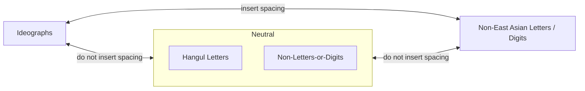

https://drafts.csswg.org/css-text-4/#non-ideographic-letters

According to the current definition of [non-ideographic letters](https://drafts.csswg.org/css-text-4/#non-ideographic-letters), there seems to be extra spacing between Hangul and Hanja in [Korean mixed script](https://en.wikipedia.org/wiki/Korean_mixed_script), but there shouldn't be.

-----

[Example](https://en.wikipedia.org/wiki/Korean_mixed_script#Example):

👆 `text-autospace: no-autospace;`

👆 `text-autospace: normal;`

<!-- comment id=1953411843 author=frivoal created=2024-02-20T03:05:36Z url=https://github.com/w3c/csswg-drafts/issues/9979#issuecomment-1953411843 -->
## @frivoal — 2024-02-20

I think you're right: I thought that maybe Hangul would have the `Han` script property in Scripts.txt or ScriptExtensions.txt (but it doesn't), or be classified as `F` in EastAsianWidth.txt. (but it is `W` instead).

I wonder if we should fix this by including Hangul in the `ideographs` grouping, or by taking it out of `non-ideographic letters`. I guess that depends on whether we expect `text-autospace: ideograph-numeric` to inject spacing between Hangul letters and non-ideographic numerals. My guess would be that we do, and that even though they're not actually ideographs, typographically, Hangul syllables are largely similar to ideographs, and should be included in the `ideographs` grouping.

<!-- comment id=1954166130 author=frivoal created=2024-02-20T12:59:33Z url=https://github.com/w3c/csswg-drafts/issues/9979#issuecomment-1954166130 -->
## @frivoal — 2024-02-20

Btw, I had forgotten about this, but see also https://github.com/w3c/csswg-drafts/pull/9503. We should make sure it does the right thing here.

<!-- comment id=2441197598 author=tats-u created=2024-10-28T10:31:54Z url=https://github.com/w3c/csswg-drafts/issues/9979#issuecomment-2441197598 -->
## @tats-u — 2024-10-28

https://github.com/prettier/prettier/pull/5040
https://github.com/prettier/prettier/issues/5028

<!-- comment id=3688688553 author=OverflowCat created=2025-12-24T05:01:52Z url=https://github.com/w3c/csswg-drafts/issues/9979#issuecomment-3688688553 -->
## @OverflowCat — 2025-12-24

> I wonder if we should fix this by including Hangul in the `ideographs` grouping, or by taking it out of `non-ideographic letters`. I guess that depends on whether we expect `text-autospace: ideograph-numeric` to inject spacing between Hangul letters and non-ideographic numerals. My guess would be that we do, and that even though they're not actually ideographs, typographically, Hangul syllables are largely similar to ideographs, and should be included in the `ideographs` grouping.

Also see my reply in https://github.com/w3c/klreq/issues/58#issuecomment-3688659807 — the extra spacing should be determined by the semantics of spacing in that language rather than ideo/non-ideo letters.

Chinese Wikipedia started enabling `text-autospace: normal` sitewide by default this month, and Korean text is excluded after my report. We [decided](https://zh.wikipedia.org/wiki/Wikipedia:%E4%BA%92%E5%8A%A9%E5%AE%A2%E6%A0%88/%E6%8A%80%E6%9C%AF#c-%E5%86%85%E5%AD%98%E6%BA%A2%E5%87%BA%E7%9A%84%E7%8C%AB-20251215055000-Lilydjwg-20251017153500) that there should not be extra spaing between Hangul and Hanja (part of the discussion happens in Telegram group):

<!-- comment id=4322306218 author=tats-u created=2026-04-26T14:59:11Z url=https://github.com/w3c/csswg-drafts/issues/9979#issuecomment-4322306218 -->
## @tats-u — 2026-04-26

Hangul should be added to the same category as symbols and punctuation:

Hangul should not be added to "ideographs" or "non-ideographic letters".

<!-- comment id=4332503218 author=anawhj created=2026-04-28T05:09:25Z url=https://github.com/w3c/csswg-drafts/issues/9979#issuecomment-4332503218 -->
## @anawhj — 2026-04-28

> Hangul should not be added to "ideographs" or "non-ideographic letters".

I completely agree. Unlike Chinese and Japanese, Hangul should not have automatic spacing when used alongside either ideographic or non-ideographic characters. Therefore, from a spacing perspective, it is appropriate to categorize Hangul as "Neutral" belonging to neither group as illustrated in the diagram above.

After verifying the behavior of the text-autospace CSS property for Hangul, I confirmed that it does not apply spacing in any scenario, which is indeed the correct behavior.

<!-- comment id=4565118984 author=r12a created=2026-05-28T14:32:29Z url=https://github.com/w3c/csswg-drafts/issues/9979#issuecomment-4565118984 -->
## @r12a — 2026-05-28

See also https://github.com/w3c/klreq/issues/58

<!-- comment id=4634205595 author=fantasai created=2026-06-05T18:06:58Z url=https://github.com/w3c/csswg-drafts/issues/9979#issuecomment-4634205595 -->
## @fantasai — 2026-06-05

Proposal: Per discussion in https://github.com/w3c/klreq/issues/58, make Hangul neutral for `text-autospace`: it does not cause insertion of spaces between it and ideographs or alphanumerics.

<!-- comment id=4675946406 author=xfq created=2026-06-11T00:18:36Z url=https://github.com/w3c/csswg-drafts/issues/9979#issuecomment-4675946406 -->
## @xfq — 2026-06-11

We need to make sure https://www.unicode.org/reports/tr59/ is updated too, since it's categorized as an [East Asian script](https://www.unicode.org/reports/tr59/#UTR59-D2).

If there are no objections, I will submit something like the following comments to Unicode:

-----

I am writing to provide feedback regarding the categorization of Hangul (Script=Hang) under UTR #59 (East Asian Spacing).

Currently, Hangul is classified under the "Wide" (W) property value, meaning layout engines will automatically insert a typographic gap between Hangul and "Narrow" (N) characters (such as Latin letters and numerals). While this behavior is highly beneficial for Chinese and Japanese, it is generally undesirable for Korean.

I would like to request that Hangul be treated as "Other" (O) by default, because:

1. Unlike Chinese and Japanese, modern Korean uses word spacing.

2. In Korean grammar, particles must be attached directly to the preceding noun with no intervening space. When a noun is written in Latin script and the particle in Hangul (e.g., "W3C를" or "Unicode는"), injecting an automatic typographic gap between the Latin character and the Hangul particle violates standard Korean orthography.

3. The "Requirements for Hangul Text Layout and Typography" (KLReq)[1] states that "where words written in the Latin script are followed by grammatical particles in the Korean language, there is no space between the Latin text and the following Korean characters."

[1] https://www.w3.org/International/klreq/#h_segmentation

<!-- comment id=4681808296 author=r12a created=2026-06-11T14:46:43Z url=https://github.com/w3c/csswg-drafts/issues/9979#issuecomment-4681808296 -->
## @r12a — 2026-06-11

The i18n WG believes that the current approach outlined for Korean text in the spec's autospace definition is incorrect, and would like to see the spec changed so that Hangul does not produce autospacing (whether the final implementation is defined directly or via the Unicode TR59 – we will also raise this issue against TR59). We are therefore changing the label to i18n-needs-resolution.

<!-- comment id=4681943699 author=r12a created=2026-06-11T15:01:06Z url=https://github.com/w3c/csswg-drafts/issues/9979#issuecomment-4681943699 -->
## @r12a — 2026-06-11

I suspect that we can go ahead and deal with the Hangul quickly and easily.

I think we have agreement that there should be no autospacing between Hangul and Hanja characters, nor between Hangul and Latin characters.

However, we may also need to consider whether Hanja should be treated in the same way.  For this we probably need advice from Korean experts.  Eg. if a 'word' is composed of some Latin text with a suffix using Hanja, then we'd need to specify that the language should be used as a prompt to indicate that Han characters (ie. Hanja) in Korean should not produce autospacing, either.  I don't know whether there is a real need for this or not — Korean folks please advise!

<!-- comment id=4686641518 author=xfq created=2026-06-12T01:56:09Z url=https://github.com/w3c/csswg-drafts/issues/9979#issuecomment-4686641518 -->
## @xfq — 2026-06-12

With `lang="ko"`, I think no autospace should be needed, including Hangul and Hanja. Natural spaces should be sufficient.

<!-- comment id=4742655720 author=r12a created=2026-06-18T13:54:29Z url=https://github.com/w3c/csswg-drafts/issues/9979#issuecomment-4742655720 -->
## @r12a — 2026-06-18

Please note that the i18n WG changed the label for this issue from i18n-tracker to i18n-needs-resolution.
